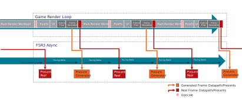
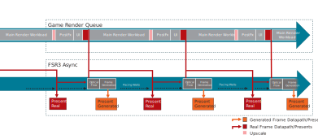

<!-- @page page_techniques_frame-interpolation FidelityFX Frame Interpolation 3.1.5 -->

<h1>FidelityFX Frame Interpolation 3.1.5</h1>

<h2>Table of contents</h2>

- [Introduction](#introduction)
    - [Shading language requirements](#shading-language-requirements)
- [Integration](#integration)
    - [Memory Usage](#memory-usage)
    - [Create frame generation context](#create-frame-generation-context)
    - [Configure frame generation](#configure-frame-generation)
        - [Distortion Field](#distortion-field)
    - [UI Composition](#ui-composition)
    - [Dispatch frame generation preparation](#dispatch-frame-generation-preparation)
    - [Dispatch frame generation](#dispatch-frame-generation)
    - [Shutdown](#shutdown)
    - [Thread safety](#thread-safety)
    - [Resource Lifetime](#resource-lifetime)
    - [Debug Checker](#debug-checker)
    - [Debug output](#debug-output)
- [Building the sample](#building-the-sample)
- [Limitations](#limitations)
- [Version history](#version-history)
- [See also](#see-also)

<h2>Introduction</h2>

**FidelityFX Frame Interpolation** is a technique that analytically generates an intermediate frame from two consecutive source images, interpolating the motion of pixels between the start & end images. 

The frame generation context computes the interpolated image. Once this is accomplished, the interpolated and real back buffers still need to be used, i.e. usually sent to the swapchain. On the topic of how to handle presentation and pacing of the back buffers, please refer to the [frame interpolation swapchain](frame-interpolation-swap-chain.md) documentaion.

<h3>Shading language requirements</h3>

- `HLSL`
  - `CS_6_2`
  - `CS_6_6†`

† `CS_6_6` is used on some hardware which supports 64-wide wavefronts.

<h2>Integration</h2>

FidelityFX Frame Interpolation should be integrated using the [FidelityFX API](../getting-started/ffx-api.md). This document describes the API constructs specific to FidelityFX Frame Interpolation.

<h3>Memory Usage</h3>

Figures are given to the nearest MB, taken on Radeon RX 9070 XTX using DirectX 12, and are subject to change. Does not include frame generation swapchain overheads.

| Output resolution | Memory usage(MB)                |
|-------------------|---------------------------------|
| 3840x2160         | 457                             |
| 2560x1440         | 214                             |
| 1920x1080         | 124                             |

An application can get amount of GPU local memory required by Frame Interpolation after context creation by calling [`ffxQuery`](../../Kits/FidelityFX/api/include/ffx_api.h#L150) with the valid context and [`ffxQueryDescFrameGenerationGetGPUMemoryUsage`](../../Kits/FidelityFX/framegeneration/include/ffx_framegeneration.h#L157).

An application can get GPU local memory required by default Frame Interpolation version before context creation by calling [`ffxQuery`](../../Kits/FidelityFX/api/include/ffx_api.h#L150) with `NULL` context and filling out [`ffxQueryDescFrameGenerationGetGPUMemoryUsageV2`](../../Kits/FidelityFX/framegeneration/include/ffx_framegeneration.h#L190). To get the memory requirement info for a different Frame Interpolation version, additionally link [`ffxOverrideVersion`](../../Kits/FidelityFX/api/include/ffx_api.h#L99). 

See code examples how to call [Query](../getting-started/ffx-api.md#Query).

<h3>Create frame generation context</h3>

In order to use frame generation first call [`ffxCreateContext`](../../Kits/FidelityFX/api/include/ffx_api.h#L132) with a description for frame generation and a backend description.

The [`ffxCreateContextDescFrameGeneration`](../../Kits/FidelityFX/framegeneration/include/ffx_framegeneration.h#L63) structure contains configuration data:
 * A set of initialization flags
 * The maximum resolution the rendering will be performed at
 * The resolution of the resources that will get interpolated
 * The format of the resources that will get interpolated

The initialization flags are provided though the [`FfxApiCreateContextFramegenerationFlags`](../../Kits/FidelityFX/framegeneration/include/ffx_framegeneration.h#L34) enumeration:

| Flag                                            | Note                                                                                                                         |
|-------------------------------------------------|------------------------------------------------------------------------------------------------------------------------------|
| [`FFX_FRAMEGENERATION_ENABLE_ASYNC_WORKLOAD_SUPPORT`](../../Kits/FidelityFX/framegeneration/include/ffx_framegeneration.h#L36) | A bit indicating whether the context supports async. dispatch for frame-generation workloads. |
| [`FFX_FRAMEGENERATION_ENABLE_DISPLAY_RESOLUTION_MOTION_VECTORS`](../../Kits/FidelityFX/framegeneration/include/ffx_framegeneration.h#L37) | A bit indicating if the motion vectors are rendered at display resolution. |
| [`FFX_FRAMEGENERATION_ENABLE_MOTION_VECTORS_JITTER_CANCELLATION`](../../Kits/FidelityFX/framegeneration/include/ffx_framegeneration.h#L38) | A bit indicating that the motion vectors have the jittering pattern applied to them. |
| [`FFX_FRAMEINTERPOLATION_ENABLE_DEPTH_INVERTED`](../../Kits/FidelityFX/framegeneration/include/ffx_framegeneration.h#L39) | A bit indicating that the input depth buffer data provided is inverted [1..0].A bit indicating the depth buffer is inverted. |
| [`FFX_FRAMEINTERPOLATION_ENABLE_DEPTH_INFINITE `](../../Kits/FidelityFX/framegeneration/include/ffx_framegeneration.h#L40) | A bit indicating that the input depth buffer data provided is using an infinite far plane.                                   |
| [`FFX_FRAMEGENERATION_ENABLE_HIGH_DYNAMIC_RANGE`](../../Kits/FidelityFX/framegeneration/include/ffx_framegeneration.h#L41) | A bit indicating if the input color data provided to all inputs is using a high-dynamic range.                                                                    |
| [`FFX_FRAMEGENERATION_ENABLE_DEBUG_CHECKING`](../../Kits/FidelityFX/framegeneration/include/ffx_framegeneration.h#L42) | A bit indicating that the runtime should check some API values and report issues.                                             |

Example using the C++ helpers:

```C++
ffx::Context frameGenContext;
ffx::CreateBackendDX12Desc backendDesc{};
backendDesc.device = GetDevice()->DX12Device();

ffx::CreateContextDescFrameGeneration createFg{};
createFg.displaySize = {resInfo.DisplayWidth, resInfo.DisplayHeight};
createFg.maxRenderSize = {resInfo.DisplayWidth, resInfo.DisplayHeight};
createFg.flags = FFX_FRAMEGENERATION_ENABLE_HIGH_DYNAMIC_RANGE;

if (m_EnableAsyncCompute)
    createFg.flags |= FFX_FRAMEGENERATION_ENABLE_ASYNC_WORKLOAD_SUPPORT;

createFg.backBufferFormat = SDKWrapper::GetFfxSurfaceFormat(GetFramework()->GetSwapChain()->GetSwapChainFormat());
ffx::ReturnCode retCode = ffx::CreateContext(frameGenContext, nullptr, createFg, backendDesc);
```

<h3>Configure frame generation</h3>

Configure frame generation by filling out the [`ffxConfigureDescFrameGeneration`](../../Kits/FidelityFX/framegeneration/include/ffx_framegeneration.h#L104) structure with the required arguments and calling [`ffxConfigure`](../../Kits/FidelityFX/api/include/ffx_api.h#L144).

This must be called once per frame. The frame ID must increment by exactly 1 each frame. Any other difference between consecutive frames will reset frame generation logic.

| [`ffxConfigureDescFrameGeneration`](../../Kits/FidelityFX/framegeneration/include/ffx_framegeneration.h#L104) member | Note                                                                                                                               |
|---------------------------------------------------|------------------------------------------------------------------------------------------------------------------------------------|
| [`swapChain`](../../Kits/FidelityFX/framegeneration/include/ffx_framegeneration.h#L107)                                           | The swapchain to use with frame generation.                                                                             |
| [`presentCallback`](../../Kits/FidelityFX/framegeneration/include/ffx_framegeneration.h#L108)                                           | A UI composition callback to call when finalizing the frame image.                                                                             |
| [`presentCallbackUserContext`](../../Kits/FidelityFX/framegeneration/include/ffx_framegeneration.h#L109)                                           | A pointer to be passed to the UI composition callback.                                                                             |
| [`frameGenerationCallback`](../../Kits/FidelityFX/framegeneration/include/ffx_framegeneration.h#L110)                                           | The frame generation callback to use to generate a frame.                                                                             |
| [`frameGenerationCallbackUserContext`](../../Kits/FidelityFX/framegeneration/include/ffx_framegeneration.h#L111)                                           | A pointer to be passed to the frame generation callback.                                                                             |
| [`frameGenerationEnabled`](../../Kits/FidelityFX/framegeneration/include/ffx_framegeneration.h#L112)                                           | Sets the state of frame generation. Set to false to disable frame generation.                                                                             |
| [`allowAsyncWorkloads`](../../Kits/FidelityFX/framegeneration/include/ffx_framegeneration.h#L113)                                           | Sets the state of async workloads. Set to true to enable generation work on async compute.                                                                             |
| [`HUDLessColor`](../../Kits/FidelityFX/framegeneration/include/ffx_framegeneration.h#L114)                                           | The hudless back buffer image to use for UI extraction from backbuffer resource. May be empty.                                                                             |
| [`flags`](../../Kits/FidelityFX/framegeneration/include/ffx_framegeneration.h#L115)                                           | Zero or combination of flags from [`FfxApiDispatchFrameGenerationFlags`](../../Kits/FidelityFX/framegeneration/include/ffx_framegeneration.h#L45).                                                                             |
| [`onlyPresentGenerated`](../../Kits/FidelityFX/framegeneration/include/ffx_framegeneration.h#L116)                                           | Set to true to only present generated frames.                                                                             |
| [`generationRect`](../../Kits/FidelityFX/framegeneration/include/ffx_framegeneration.h#L117)                                           | The area of the backbuffer that should be used for generation in case only a part of the screen is used e.g. due to movie bars                                                                             |
| [`frameID`](../../Kits/FidelityFX/framegeneration/include/ffx_framegeneration.h#L118)                                           | Identifier used to select internal resources when async support is enabled. Must increment by exactly one (1) for each frame. Any non-exactly-one difference will reset the frame generation logic.                                                                             |


```C++
// Update frame generation config
FfxApiResource hudLessResource = SDKWrapper::ffxGetResourceApi(m_pHudLessTexture[m_curUiTextureIndex]->GetResource(), FFX_API_RESOURCE_STATE_COMPUTE_READ);

m_FrameGenerationConfig.frameGenerationEnabled = m_FrameInterpolation;
m_FrameGenerationConfig.flags                  = 0;
m_FrameGenerationConfig.flags |= m_DrawFrameGenerationDebugTearLines ? FFX_FRAMEGENERATION_FLAG_DRAW_DEBUG_TEAR_LINES : 0;
m_FrameGenerationConfig.flags |= m_DrawFrameGenerationDebugResetIndicators ? FFX_FRAMEGENERATION_FLAG_DRAW_DEBUG_RESET_INDICATORS : 0;
m_FrameGenerationConfig.flags |= m_DrawFrameGenerationDebugView ? FFX_FRAMEGENERATION_FLAG_DRAW_DEBUG_VIEW : 0;
m_FrameGenerationConfig.HUDLessColor = (s_uiRenderMode == 3) ? hudLessResource : FfxApiResource({});
m_FrameGenerationConfig.allowAsyncWorkloads = m_AllowAsyncCompute && m_EnableAsyncCompute;
// assume symmetric letterbox
m_FrameGenerationConfig.generationRect.left   = (resInfo.DisplayWidth - resInfo.UpscaleWidth) / 2;
m_FrameGenerationConfig.generationRect.top    = (resInfo.DisplayHeight - resInfo.UpscaleHeight) / 2;
m_FrameGenerationConfig.generationRect.width  = resInfo.UpscaleWidth;
m_FrameGenerationConfig.generationRect.height = resInfo.UpscaleHeight;
// For sample purposes only. Most applications will use one or the other.
if (m_UseCallback)
{
    m_FrameGenerationConfig.frameGenerationCallback = [](ffxDispatchDescFrameGeneration* params, void* pUserCtx) -> ffxReturnCode_t
    {
        return ffxDispatch(reinterpret_cast<ffxContext*>(pUserCtx), &params->header);
    };
    m_FrameGenerationConfig.frameGenerationCallbackUserContext = &m_FrameGenContext;
}
else
{
    m_FrameGenerationConfig.frameGenerationCallback = nullptr;
    m_FrameGenerationConfig.frameGenerationCallbackUserContext = nullptr;
}
m_FrameGenerationConfig.onlyPresentGenerated = m_PresentInterpolatedOnly;
m_FrameGenerationConfig.frameID = m_FrameID;

m_FrameGenerationConfig.swapChain = GetSwapChain()->GetImpl()->DX12SwapChain();

ffx::ReturnCode retCode = ffx::Configure(m_FrameGenContext, m_FrameGenerationConfig);
CauldronAssert(ASSERT_CRITICAL, !!retCode, L"Configuring FSR FG failed: %d", (uint32_t)retCode);
```

If using the frame generation callback, the swapchain will call the callback with appropriate parameters.
Otherwise, the application is responsible for calling the frame generation dispatch and setting parameters itself.
In that case, the frame ID must be equal to the frame ID used in configuration. The command list and output texture can be queried from the frame generation context using [`ffxQuery`](../../Kits/FidelityFX/api/include/ffx_api.h#L150). See the [sample code](../../Samples/Upscalers/FidelityFX_FSR/dx12/fsrapirendermodule.cpp#L1172) for an example.

The user context pointers will only be passed into the respective callback functions. FSR code will not attempt to dereference them.

When [`allowAsyncWorkloads`](../../Kits/FidelityFX/framegeneration/include/ffx_framegeneration.h#L113) is set to `false` the main graphics queue will be used to execute the Optical Flow and Frame Generation workloads. It is strongly advised to profile, if significant performance benefits can be gained from asynchronous compute usage. Not using asynchronous compute will result in a lower memory overhead.

Note that UI composition and presents will always get executed on an async queue, so they can be paced and injected into the middle of the workloads generating the next frame.



When [`allowAsyncWorkloads`](../../Kits/FidelityFX/framegeneration/include/ffx_framegeneration.h#L113) is set to `true`, the Optical Flow and Frame Generation workloads will run on an asynchronous compute queue and overlap with workloads of the next frame on the main game graphics queue. This can improve performance depending on the GPU and workloads.



<h3>UI Composition</h3>

For frame interpolation the user interface will require some special treatment, otherwise very noticeable artifacts will be generated which can impact readability of the interface. 

To prohibit those artifacts frame-generation supports various options to handle the UI:

The preferred method is to use the [`presentCallback`](../../Kits/FidelityFX/framegeneration/include/ffx_framegeneration.h#L108). The function provided in this parameter will get called once for every frame presented and allows the application to schedule the GPU workload required to render the UI. By using this function the application can reduce UI input latency and render effects that do not work well with frame generation (e.g. film grain).

The UI composition callback function will be called for every frame (real or generated) to allow rendering the UI separately for each presented frame, so the UI can get rendered at presentation rate to achieve smooth UI animations.

```C++
ffxReturnCode_t FSR3RenderModule::UiCompositionCallback(ffxCallbackDescFrameGenerationPresent* params, void* userCtx)
{
    ID3D12GraphicsCommandList2* pDxCmdList  = reinterpret_cast<ID3D12GraphicsCommandList2*>(params->commandList);
    ID3D12Resource*             pRtResource = reinterpret_cast<ID3D12Resource*>(params->outputSwapChainBuffer.resource);
    ID3D12Resource*             pBbResource = reinterpret_cast<ID3D12Resource*>(params->currentBackBuffer.resource);

    // Use pDxCmdList to copy pBbResource and render UI into the outputSwapChainBuffer.
    // The backbuffer is provided as SRV so postprocessing (e.g. adding a blur effect behind the UI) can easily be applied

    return FFX_API_RETURN_OK;
}
```


If frame generation is disabled [`presentCallback`](../../Kits/FidelityFX/framegeneration/include/ffx_framegeneration.h#L108) will still get called on present.


The second option to handle the UI is to render the UI into a dedicated surface that will be blended onto the interpolated and real backbuffer before present. Composition of this surface can be done automatically composed by the proxy swapchain or manually in the [`presentCallback`](../../Kits/FidelityFX/framegeneration/include/ffx_framegeneration.h#L108). This method allows to present an UI unaffected by frame interpolation, however the UI will only be rendered at render rate. For applications with a largely static UI this might be a good solution without the additional overhead of rendering the UI at presentation rate.


If frame generation is disabled and the UI Texture is provided, UI composition will still get executed by the frame interpolation swapchain.


In that case the surface needs to be registered to the swap chain by calling [`ffxConfigure`](../../Kits/FidelityFX/api/include/ffx_api.h#L144) with a [`ffxConfigureDescFrameGenerationSwapChainRegisterUiResourceDX12`](../../Kits/FidelityFX/framegeneration/include/dx12/ffx_api_framegeneration_dx12.h#L59) structure.

Flags can be provided in [`ffxConfigureDescFrameGenerationSwapChainRegisterUiResourceDX12`](../../Kits/FidelityFX/framegeneration/include/dx12/ffx_api_framegeneration_dx12.h#L59) to control the following:

| [`FfxApiUiCompositionFlags`](../../Kits/FidelityFX/framegeneration/include/ffx_framegeneration.h#L56) member | Note                                                                                                                               |
|---------------------------------------------------|------------------------------------------------------------------------------------------------------------------------------------|
| [`FFX_FRAMEGENERATION_UI_COMPOSITION_FLAG_USE_PREMUL_ALPHA`](../../Kits/FidelityFX/framegeneration/include/ffx_framegeneration.h#L58)                                           | A bit indicating that we use premultiplied alpha for UI composition.                                                                             |
| [`FFX_FRAMEGENERATION_UI_COMPOSITION_FLAG_ENABLE_INTERNAL_UI_DOUBLE_BUFFERING`](../../Kits/FidelityFX/framegeneration/include/ffx_framegeneration.h#L59)                                           | A bit indicating that the swapchain should doublebuffer the UI resource.                                                                             |

```C++
FfxResource uiColor = ffxGetResource(m_pUiTexture[m_curUiTextureIndex]->GetResource(), L"FSR3_UiTexture", FFX_RESOURCE_STATE_PIXEL_COMPUTE_READ);
ffx::ConfigureDescFrameGenerationSwapChainRegisterUiResourceDX12 uiConfig{};
uiConfig.uiResource = uiColor;
uiConfig.flags      = m_DoublebufferInSwapchain ? FFX_FRAMEGENERATION_UI_COMPOSITION_FLAG_ENABLE_INTERNAL_UI_DOUBLE_BUFFERING : 0;
ffx::Configure(m_SwapChainContext, uiConfig);
```

The final method to handle the UI is to provide a [`HUDLessColor`](../../Kits/FidelityFX/framegeneration/include/ffx_framegeneration.h#L114) surface in the [`FfxFrameGenerationConfig`](../../Kits/FidelityFX/api/internal/ffx_interface.h#L473). This surface will get used during frame interpolation to detect the UI and avoid distortion on UI elements. This method has been added for compatibility with engines that can not apply either of the other two options for UI rendering.


<h4>Different HUDless Formats</h4>

An optional structure [`ffxCreateContextDescFrameGenerationHudless`](../../Kits/FidelityFX/framegeneration/include/ffx_framegeneration.h#L172) can be linked to the [`pNext`](../../Kits/FidelityFX/api/include/ffx_api.h#L56) of the [`ffxCreateContextDescFrameGeneration`](../../Kits/FidelityFX/framegeneration/include/ffx_framegeneration.h#L63) used at context-creation time to enable the application to use a different [`hudlessBackBufferformat`](../../Kits/FidelityFX/framegeneration/include/ffx_framegeneration.h#L175) (IE.RGBA8_UNORM) from [`backBufferFormat`](../../Kits/FidelityFX/framegeneration/include/ffx_framegeneration.h#L69) (IE. BGRA8_UNORM).


<h4>Distortion Field</h4>

When an application uses a distortion effect this can hinder the frame generation algorithm from correctly interpolating the motion of objects. An application can configure the frame generation context with an additional [`distortionField`](../../Kits/FidelityFX/framegeneration/include/ffx_framegeneration.h#L167) texture assigned in a [`ffxConfigureDescFrameGenerationRegisterDistortionFieldResource`](../../Kits/FidelityFX/framegeneration/include/ffx_framegeneration.h#L164) structure and applied by calling [`ffxConfigure`](../../Kits/FidelityFX/api/include/ffx_api.h#L143). 

The [`distortionField`](../../Kits/FidelityFX/framegeneration/include/ffx_framegeneration.h#L167) texture must contain distortion offset data in a 2-component (ie. RG) format. It is read by FG shaders via Sample. Resource's xy components encodes [UV coordinate of pixel after lens distortion effect, UV coordinate of pixel before lens distortion].

<h3>Dispatch frame generation preparation</h3>

Since version 3.1.0, frame generation runs independently of FSR upscaling. To replace the resources previously shared with the upscaler, a new frame generation prepare pass is required.

After the call to [`ffxConfigure`](../../Kits/FidelityFX/api/include/ffx_api.h#L144), fill out both a [`ffxDispatchDescFrameGenerationPrepare`](../../Kits/FidelityFX/framegeneration/include/ffx_framegeneration.h#L122) structure and a [`ffxDispatchDescFrameGenerationPrepareCameraInfo`](../../Kits/FidelityFX/framegeneration/include/ffx_framegeneration.h#L180) structure. The [`ffxDispatchDescFrameGenerationPrepareCameraInfo`](../../Kits/FidelityFX/framegeneration/include/ffx_framegeneration.h#L180) should be linked in the [`pNext`](../../Kits/FidelityFX/api/include/ffx_api.h#L56) field of the [`ffxDispatchDescFrameGenerationPrepare`](../../Kits/FidelityFX/framegeneration/include/ffx_framegeneration.h#L122) structure header. Then provide the structure and frame generation context in a call to [`ffxDispatch`](../../Kits/FidelityFX/api/include/ffx_api.h#L155).

| [`ffxDispatchDescFrameGenerationPrepare`](../../Kits/FidelityFX/framegeneration/include/ffx_framegeneration.h#L122) member | Note                                                                                                                               |
|---------------------------------------------------|------------------------------------------------------------------------------------------------------------------------------------|
| [`frameID`](../../Kits/FidelityFX/framegeneration/include/ffx_framegeneration.h#L125)                                           | Identifier used to select internal resources when async support is enabled. Must increment by exactly one (1) for each frame. Any non-exactly-one difference will reset the frame generation logic. Set the frameID to the same value as in the [`ffxConfigureDescFrameGeneration`](../../Kits/FidelityFX/framegeneration/include/ffx_framegeneration.h#L104) structure.                                                                             |
| [`flags`](../../Kits/FidelityFX/framegeneration/include/ffx_framegeneration.h#L126)                                           | Zero or combination of values from [`FfxApiDispatchFrameGenerationFlags`](../../Kits/FidelityFX/framegeneration/include/ffx_framegeneration.h#L45).                                                                             |
| [`commandList`](../../Kits/FidelityFX/framegeneration/include/ffx_framegeneration.h#L127)                                           | A command list to record frame generation commands into.                                                                             |
| [`renderSize`](../../Kits/FidelityFX/framegeneration/include/ffx_framegeneration.h#L128)                                           | The dimensions used to render game content, dilatedDepth, dilatedMotionVectors are expected to be of ths size.                                                                             |
| [`jitterOffset`](../../Kits/FidelityFX/framegeneration/include/ffx_framegeneration.h#L129)                                           | The subpixel jitter offset applied to the camera.                                                                             |
| [`motionVectorScale`](../../Kits/FidelityFX/framegeneration/include/ffx_framegeneration.h#L130)                                           | The scale factor to apply to motion vectors.                                                                             |
| [`frameTimeDelta`](../../Kits/FidelityFX/framegeneration/include/ffx_framegeneration.h#L132)                                           | Time elapsed in milliseconds since the last frame.                                                                            |
| [`unused_reset`](../../Kits/FidelityFX/framegeneration/include/ffx_framegeneration.h#L133)                                           | A (currently unused) boolean value which when set to true, indicates FrameGeneration will be called in reset mode.                                                                             |
| [`cameraNear`](../../Kits/FidelityFX/framegeneration/include/ffx_framegeneration.h#L134)                                           | The distance to the near plane of the camera.                                                                             |
| [`cameraFar`](../../Kits/FidelityFX/framegeneration/include/ffx_framegeneration.h#L135)                                           | The distance to the far plane of the camera. This is used only used in case of non infinite depth.                                                                             |
| [`cameraFovAngleVertical`](../../Kits/FidelityFX/framegeneration/include/ffx_framegeneration.h#L136)                                           | The camera angle field of view in the vertical direction (expressed in radians).                                                                             |
| [`viewSpaceToMetersFactor`](../../Kits/FidelityFX/framegeneration/include/ffx_framegeneration.h#L137)                                           | The scale factor to convert view space units to meters.                                                                             |
| [`depth`](../../Kits/FidelityFX/framegeneration/include/ffx_framegeneration.h#L138)                                           | The depth buffer data.                                                                             |
| [`motionVectors`](../../Kits/FidelityFX/framegeneration/include/ffx_framegeneration.h#L139)                                           | The motion vector data.                                                                             |

For fields also found in [`ffxDispatchDescUpscale`](../../Kits/FidelityFX/upscalers/include/ffx_upscale.h#L82), the same input requirements and recommendations apply here.

Set the frameID to the same value as in the configure description.

It is required to specify [`ffxDispatchDescFrameGenerationPrepareCameraInfo`](../../Kits/FidelityFX/framegeneration/include/ffx_framegeneration.h#L180) which must contain information about the camera position and orientation within the scene.

| [`ffxDispatchDescFrameGenerationPrepareCameraInfo`](../../Kits/FidelityFX/framegeneration/include/ffx_framegeneration.h#L180) member | Note                                                                                                                               |
|---------------------------------------------------|------------------------------------------------------------------------------------------------------------------------------------|
| [`cameraPosition`](../../Kits/FidelityFX/framegeneration/include/ffx_framegeneration.h#L183)                                           | The camera position in world space.                                                                             |
| [`cameraUp`](../../Kits/FidelityFX/framegeneration/include/ffx_framegeneration.h#L184)                                           | The camera up normalized vector in world space.                                                                             |
| [`cameraRight`](../../Kits/FidelityFX/framegeneration/include/ffx_framegeneration.h#L185)                                           | The camera right normalized vector in world space.                                                                             |
| [`cameraForward`](../../Kits/FidelityFX/framegeneration/include/ffx_framegeneration.h#L186)                                           | The camera forward normalized vector in world space.                                                                             |

<h3>Dispatch frame generation</h3>

In order to optimally invoke [`ffxDispatch`](../../Kits/FidelityFX/api/include/ffx_api.h#L155) for frame-generation it is *strongly* recommended that the caller supply a callback to [`frameGenerationCallback`](../../Kits/FidelityFX/framegeneration/include/ffx_framegeneration.h#L110) along with any necessary context pointer in [`frameGenerationCallbackUserContext`](../../Kits/FidelityFX/framegeneration/include/ffx_framegeneration.h#L111). This callback should execute [`ffxDispatch`](../../Kits/FidelityFX/api/include/ffx_api.h#L155) using the provided [`ffxDispatchDescFrameGeneration`](../../Kits/FidelityFX/framegeneration/include/ffx_framegeneration.h#L86) structure pointer. This will then be written into the proper command-list during the swap-chain presentation and when [`allowAsyncWorkloads`](../../Kits/FidelityFX/framegeneration/include/ffx_framegeneration.h#L113) are enabled overlapped with other work.

It is possible, but *highly* discouraged to dispatch frame-generation manually. This infrastructure exists to support specific game-engine integrations such as the Unreal Engine plugin where dispatching during swap-chain presentation is unsafe. In this case the caller must acquire an interpolation command-buffer using the [`ffxQueryDescFrameGenerationSwapChainInterpolationCommandListDX12`](../../Kits/FidelityFX/framegeneration/include/dx12/ffx_api_framegeneration_dx12.h#L67) structure on the swap-chain context and supply this as the [`commandList`](../../Kits/FidelityFX/framegeneration/include/ffx_framegeneration.h#L89) in a [`ffxDispatchDescFrameGeneration`](../../Kits/FidelityFX/framegeneration/include/ffx_framegeneration.h#L86) which can then be used to dispatch via [`ffxDispatch`](../../Kits/FidelityFX/api/include/ffx_api.h#L155). In this case the caller is responsible for understanding whether it is safe to enable [`allowAsyncWorkloads`](../../Kits/FidelityFX/framegeneration/include/ffx_framegeneration.h#L113).

| [`ffxDispatchDescFrameGeneration`](../../Kits/FidelityFX/framegeneration/include/ffx_framegeneration.h#L86) member | Note                                                                                                                               |
|---------------------------------------------------|------------------------------------------------------------------------------------------------------------------------------------|
| [`commandList`](../../Kits/FidelityFX/framegeneration/include/ffx_framegeneration.h#L89)                                           | The command list on which to register render commands.                                                                             |
| [`presentColor`](../../Kits/FidelityFX/framegeneration/include/ffx_framegeneration.h#L90)                                           | The current presentation color, this will be used as source data.                                                                            |
| [`outputs`](../../Kits/FidelityFX/framegeneration/include/ffx_framegeneration.h#L91)                                           | Destination targets (1 for each frame in numGeneratedFrames).                                                                             |
| [`numGeneratedFrames`](../../Kits/FidelityFX/framegeneration/include/ffx_framegeneration.h#L92)                                           | The number of frames to generate from the passed in color target.                                                                            |
| [`reset`](../../Kits/FidelityFX/framegeneration/include/ffx_framegeneration.h#L93)                                           | A boolean value which when set to true, indicates the camera has moved discontinuously.                                                                            |
| [`backbufferTransferFunction`](../../Kits/FidelityFX/framegeneration/include/ffx_framegeneration.h#L94)                                           | The transfer function use to convert frame generation source color data to linear RGB. One of the values from [`FfxApiBackbufferTransferFunction`](../../Kits/FidelityFX/api/include/ffx_api_types.h#L128).                                                                             |
| [`minMaxLuminance`](../../Kits/FidelityFX/framegeneration/include/ffx_framegeneration.h#L95)                                           | Min and max luminance values, used when converting HDR colors to linear RGB.                                                                             |
| [`generationRect`](../../Kits/FidelityFX/framegeneration/include/ffx_framegeneration.h#L96)                                           | The area of the backbuffer that should be used for generation in case only a part of the screen is used e.g. due to movie bars.                                                                             |
| [`frameID`](../../Kits/FidelityFX/framegeneration/include/ffx_framegeneration.h#L97)                                           | Identifier used to select internal resources when async support is enabled. Must increment by exactly one (1) for each frame. Any non-exactly-one difference will reset the frame generation logic.                                                                             |

<h3>Shutdown</h3>

During shutdown, disable UI handling and frame generation in the proxy swapchain and destroy the contexts:

```C++
// disable frame generation before destroying context
// also unset present callback, HUDLessColor and UiTexture to have the swapchain only present the backbuffer
m_FrameGenerationConfig.frameGenerationEnabled = false;
m_FrameGenerationConfig.swapChain              = GetSwapChain()->GetImpl()->DX12SwapChain();
m_FrameGenerationConfig.presentCallback        = nullptr;
m_FrameGenerationConfig.HUDLessColor           = FfxApiResource({});
ffx::Configure(m_FrameGenContext, m_FrameGenerationConfig);

ffx::ConfigureDescFrameGenerationSwapChainRegisterUiResourceDX12 uiConfig{};
uiConfig.uiResource = {};
uiConfig.flags = 0;
ffx::Configure(m_SwapChainContext, uiConfig);

// Destroy the contexts
ffx::DestroyContext(m_UpscalingContext);
ffx::DestroyContext(m_FrameGenContext);
```

Finally, destroy the proxy swap chain by releasing the handle, destroying the context  with [`ffxDestroyContext`](../../Kits/FidelityFX/api/include/ffx_api.h#L138) and re-create the normal DX12 swap chain.

<h3>Thread safety</h3>

  The ffx-api context is not guarranted to be thread safe. In this technique, `FrameGenContext` and `SwapChainContext` are not thread safe. Race condition symptom includes `access violation error` crash, interpolation visual artifact, and infinite wait in Dx12CommandPool destructor when releasing swapchain. It's not obvious but `FrameInterpolationSwapchainDX12::Present()` actually accesses `SwapChainContext` and `FrameGenContext` (for dispatching Optical Flow and Frame Generation). A race condition occurs if app threads can simutaneously call `FrameInterpolationSwapchainDX12::Present()` and `Dispatch(m_FrameGenContext, DispatchDescFrameGenerationPrepare)`. Another race condition occurance is if app threads can simutaneously call `FrameInterpolationSwapchainDX12::Present()` and `DestroyContext(SwapChainContext)`. App could acquire mutex lock before calling ffx functions that access `FrameGenContext` or `SwapChainContext` to guarantee at any time there is at most 1 thread that can access the context.

<h3>Resource Lifetime</h3>

<h4>When UiTexture composition mode is used</h4> 

<h5>If FFX_FRAMEGENERATION_UI_COMPOSITION_FLAG_ENABLE_INTERNAL_UI_DOUBLE_BUFFERING is set:</h5>

The [`currentUI`](../../Kits/FidelityFX/framegeneration/include/ffx_framegeneration.h#L79) gets copied to an internal resource on the game queue
The [`currentUI`](../../Kits/FidelityFX/framegeneration/include/ffx_framegeneration.h#L79) may be reused on the GFX queue immediately in the next frame

<h5> If FFX_FRAMEGENERATION_UI_COMPOSITION_FLAG_ENABLE_INTERNAL_UI_DOUBLE_BUFFERING is not set:</h5>

The application is responsible to ensure [`currentUI`](../../Kits/FidelityFX/framegeneration/include/ffx_framegeneration.h#L79) persists until composition of the real frame is finished
This is typically in the middle of the next frame, so the [`currentUI`](../../Kits/FidelityFX/framegeneration/include/ffx_framegeneration.h#L79) should not be used during the next frame. The application must ensure double buffering of the UITexture

<h4>When HUDLess composition mode is used:</h4>

The HUDLess texture will be used during FrameInterpolation
The application is responsible to ensure it persists until FrameInterpolation is complete
If [`allowAsyncWorkloads`](../../Kits/FidelityFX/framegeneration/include/ffx_framegeneration.h#L113) is true:
Frameinterpolation happens on an async compute queue so the HUDLess texture needs to be double buffered by the application
If [`allowAsyncWorkloads`](../../Kits/FidelityFX/framegeneration/include/ffx_framegeneration.h#L113) is false:
Frameinterpolation happens on the game GFX queue, so app can safely modify HUDLess texture in the next frame

<h4>When distortionField texture is registered to FrameInterpolation:</h4>

The application is responsible to ensure [`distortionField`](../../Kits/FidelityFX/framegeneration/include/ffx_framegeneration.h#L167) texture persists until FrameInterpolation is complete
If [`allowAsyncWorkloads`](../../Kits/FidelityFX/framegeneration/include/ffx_framegeneration.h#L113) is true:
Frameinterpolation happens on an async compute queue so the [`distortionField`](../../Kits/FidelityFX/framegeneration/include/ffx_framegeneration.h#L167) texture needs to be double buffered by the application
If [`allowAsyncWorkloads`](../../Kits/FidelityFX/framegeneration/include/ffx_framegeneration.h#L113) is false:
Frameinterpolation happens on the game GFX queue, so app can safely modify [`distortionField`](../../Kits/FidelityFX/framegeneration/include/ffx_framegeneration.h#L167) texture in the next frame

<h3>Debug Checker</h3>
Enable debug checker to validate application supplied inputs at dispatch upscale. It is recommended this is enabled only in development builds of game.

Passing 
[`FFX_FRAMEGENERATION_ENABLE_DEBUG_CHECKING`](../../Kits/FidelityFX/framegeneration/include/ffx_framegeneration.h#L42) flag within [`FfxApiCreateContextFramegenerationFlags`](../../Kits/FidelityFX/framegeneration/include/ffx_framegeneration.h#L34) will output textual warnings from frame generation to debugger TTY by default. Calling [`ffxConfigure`](../../Kits/FidelityFX/api/include/ffx_api.h#L144) with [`fpMessage`](../../Kits/FidelityFX/api/include/ffx_api.h#L83) within a [`ffxConfigureDescGlobalDebug1`](../../Kits/FidelityFX/api/include/ffx_api.h#L80) structure to a suitable function allows the application to receive the debug messages issued. 

An example of the kind of output that can occur when debug checker observes possible issues is below:

FSR_API_DEBUG_WARNING: ffxDispatchDescFrameGenerationPrepareCameraInfo needs to be passed as linked struct. This is a required input to FSR3.1.4 and onwards for best quality.

<h3>Debug output</h3>

The frame interpolation API supports several debug visualisation options:

When [`FFX_FRAMEGENERATION_FLAG_DRAW_DEBUG_TEAR_LINES`](../../Kits/FidelityFX/framegeneration/include/ffx_framegeneration.h#L47) is set in the flags attribute of [`ffxDispatchDescFrameGenerationPrepare`](../../Kits/FidelityFX/framegeneration/include/ffx_framegeneration.h#L122), the inpainting pass will add bars of changing color on the left and right border of the interpolated image. This will assist visualizing if interpolated frames are getting presented and if the frames are presented with tearing enabled.

When [`FFX_FRAMEGENERATION_FLAG_DRAW_DEBUG_RESET_INDICATORS`](../../Kits/FidelityFX/framegeneration/include/ffx_framegeneration.h#L48) is set in the flags attribute of [`ffxDispatchDescFrameGenerationPrepare`](../../Kits/FidelityFX/framegeneration/include/ffx_framegeneration.h#L122), the debug reset indicators will be drawn to the generated output.

When [`FFX_FRAMEGENERATION_FLAG_DRAW_DEBUG_VIEW`](../../Kits/FidelityFX/framegeneration/include/ffx_framegeneration.h#L49) is set in the flags attribute of [`ffxDispatchDescFrameGenerationPrepare`](../../Kits/FidelityFX/framegeneration/include/ffx_framegeneration.h#L122), the [FrameInterpolationSwapChain](frame-interpolation-swap-chain.md) will only present interpolated frames and execute an additional pass to render debug data from internal surfaces onto the interpolated frame, to allow you to debug.

When [`FFX_FRAMEGENERATION_FLAG_DRAW_DEBUG_PACING_LINES`](../../Kits/FidelityFX/framegeneration/include/ffx_framegeneration.h#L51) is set in the flags attribute of [`ffxDispatchDescFrameGenerationPrepare`](../../Kits/FidelityFX/framegeneration/include/ffx_framegeneration.h#L122), the debug pacing lines will be drawn to the generated output.


<h2>Building the sample</h2>

To build the FSR sample, please follow the following instructions:

1. Download and install the following software developer tool minimum versions:
    - [Visual Studio 2022](https://visualstudio.microsoft.com/downloads/) (Install ```vcpkg package manager``` as part of the install process)
    - [Windows 10 SDK 10.0.18362.0](https://developer.microsoft.com/en-us/windows/downloads/windows-10-sdk)

 2. Open the Visual Studio solution:

    ```bash
    > <installation path>\Samples\FidelityFX_FSR\dx12\FidelityFX_FSR_2022.sln
    ```

 3. First time vcpkg installation

   - If vcpkg has not previously been initialized in Visual Studio, please do so with the following:
     - From the menu, select ``Tools`` and then ``Visual Studio Command Prompt`` to bring up the terminal.
     - Type ``vcpkg integrate install`` and hit ``enter`` key.
     - Close and re-open the solution.

<h3>Building the project</h3>

The Visual Studio solution file (.sln) will contain all projects needed to build the effect sample. To build the projects in the solution, you should click on ``Build`` and then ``Build solution`` from the menu at the top of Visual Studio. This will build all dependencies of the sample (such as the FidelityFX Cauldron Framework), then build the sample application.

<h3>Running the project</h3>

To run a project from Visual Studio:

 1. If not already highlighted, select the sample project in the solution explorer.

 2. Right-click the project and select `Set as Start-up project`.

 3. Right-click the project and select `Properties`

 4. Under `Configuration Properties`, click on the `Debugging` entry.

 5. Set `Working Directory` to `$(TargetDir)` for all configurations (`Debug` and `Release`).

 6. Click `Apply` then `OK` to close the properties panel.

 7. Click on the `Build` menu item from the toolstrip, and then click on `Run`.

<h2>Limitations</h2>

FSR requires a GPU with typed UAV load and R16G16B16A16_UNORM support.

<h2>Version history</h2>

| Version        | Date              |
| ---------------|-------------------|
| **1.1.1**      | 2023-11-28        |
| **1.1.2**      | 2024-06-05        |
| **1.1.3**      | 2025-05-08        |
| **3.1.5**      | 2025-08-20        |

Refer to changelog for more detail on versions.

<h2>See also</h2>

- [FidelityFX Super Resolution](../samples/super-resolution.md)
- [FidelityFX Naming guidelines](../getting-started/naming-guidelines.md)
