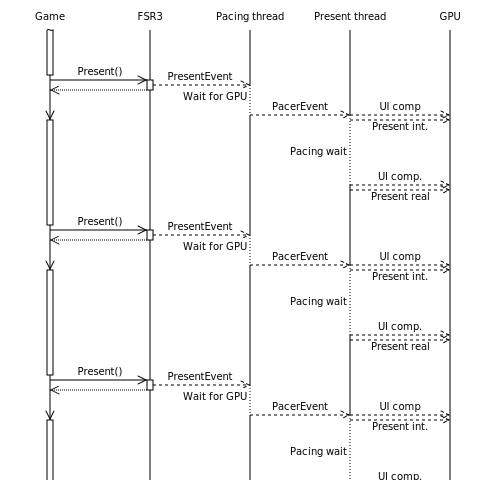

# Frame Pacing in FSR3

With frame generation enabled, frames can take wildly different amounts of time to render.
The workload for interpolated frames can be much smaller than for application rendered frames ("real" frames).
It is therefore important to properly pace presentation of frames to ensure a smooth experience.
The goal here is to display each frame for an equal amount of time.

Presentation and pacing are done on two new threads separate from the main render loop.

A high-priority pacing thread keeps track of average frame time and calculates the target presentation time.
It also waits for gpu work to finish to avoid long GPU-side waits after the CPU-side presentation call.

To prevent frame time spikes from impacting pacing too much, the moving average of the past seven frames is used
to calculate a stable frame time.

A present thread dispatches frame composition work and first presents the interpolated frame, then waits
until the target presentation time and presents the real frame.

The present interval is always set to 0 (queueing disabled) to avoid waits in the presentation backend.
If supported, the allow-tearing-flag is set if and only if the interpolated frame rate exceeds the monitor's
refresh rate.

If the application presents to the proxy swapchain using a non-zero present interval, tearing is always disabled.
In these cases, the call to the presentation backend may block on some drivers, which prevents the frame rate from
exceeding the monitor's refresh rate. On AMD Radeon graphics cards, users should enable Enhanced Sync in AMD Software
to avoid this behavior.

The application should ensure that the rendered frame rate is as close as possible to, but ideally slightly below
half the desired output frame rate.

<!-- Is this our recommendation, since we needed to do this in Cauldron? -->
It is recommended to use normal priority for any GPU queues created by the application to allow interpolation
work to be scheduled with higher priority. In addition, developers should take care that command lists running
concurrently with interpolation and composition are short (in terms of execution time) to allow presentation
to be scheduled at a precise time.

## Expected behavior

To further illustrate the pacing method and rationale behind it, the following sections will lay out expected
behavior in different scenarios. We differentiate based on the post-interpolation frame rate as well as whether
the display uses a fixed or variable refresh rate.

### Fixed refresh rate

#### Interpolated frame rate below display refresh rate

Here, tearing is disabled. Presentation is synchronized to the monitor's vertical blanking period ("VSync").
This may result in uneven display timings and may increase input latency (by up to one refresh period).

In the diagram, the first real frame is presented slighly after the vertical blanking interval,
leading to the prior interpolated frame being shown for two refresh intervals and increased latency compared to immediate display.

#### Interpolated frame rate above display refresh rate

In this case, tearing is enabled and likely to occur. Presentation is not synchronized with the monitor.
The benefit of this is reduced input latency compared to lower frame rates.

### Variable refresh rate

This section applies to displays with support for variable refresh rate (VRR) technology, such as AMD FreeSync.

The timing between display refreshes is dictated by the variable refresh rate window. The delta time between two
refreshes can be any time inside the window. As an example, if the VRR window is 64-120Hz, then the delta time
must be between 8.33 and 15.625 milliseconds. If the delta is outside this window, tearing will likely occur.

If no present happens inside the window, the previous frame is scanned out again.

#### Interpolated frame rate inside VRR window

The variable refresh window usually does not extend above the reported native refresh rate,
so tearing will be disabled in this case.

#### Interpolated frame rate outside VRR window

If the frame rate is below the lower bound of the VRR window, the expected behavior is the same as if
the frame rate is below the refresh rate of a fixed refresh rate display (see above).

If the frame rate is above the upper bound of the VRR window, the expected behavior is the same as
if the frame rate is above the refresh rate of a fixed refresh rate display (see above).
