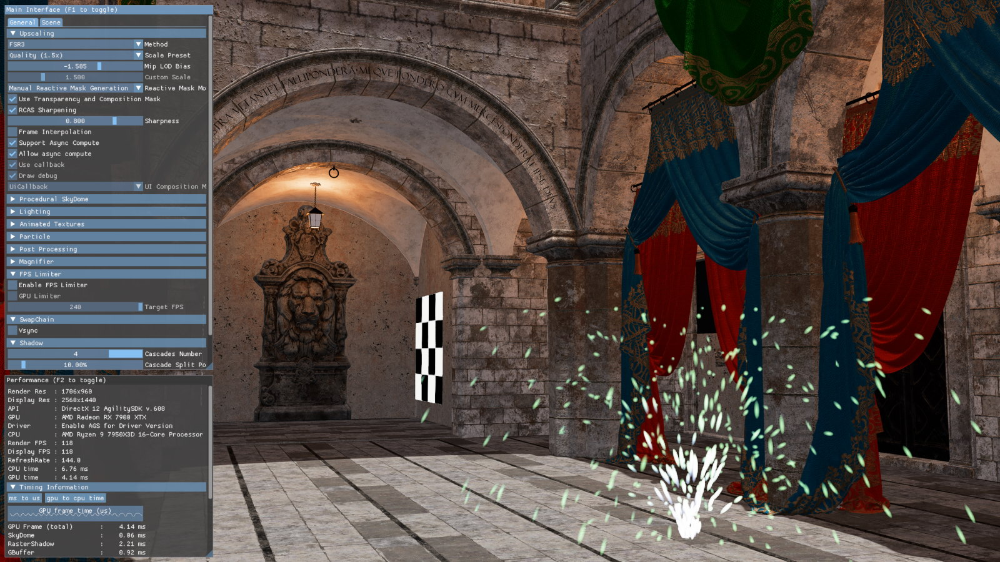

<!-- @page page_techniques_super-resolution-interpolation FidelityFX Super Resolution 3.0 Interpolation -->

<h1>FidelityFX Super Resolution 3.0.3 (FSR3) - Interpolation</h1>



<h2>Table of contents</h2>

- [FidelityFX Super Resolution 3.0.3 (FSR3)](#fidelityfx-super-resolution-303-fsr3)
  - [Table of contents](#table-of-contents)
  - [Introduction](#introduction)
  - [Integration guidelines](#integration-guidelines)
    - [Shading language and API requirements](#shading-language-and-api-requirements)
      - [DirectX 12 + HLSL](#directx-12--hlsl)
      - [Vulkan + GLSL](#vulkan--glsl)
  - [Quick start checklist](#quick-start-checklist)
    - [Expected input](#expected-input)
    - [Walkthrough](#walkthrough)
      - [Add upscaling through FSR3 interface](#add-upscaling-through-fsr3-interface)
      - [Enable FSR3's proxy frame interpolation swapchain](#enable-fsr3-s-proxy-frame-interpolation-swapchain)
      - [Dispatch Upscaling](#dispatch-upscaling)
      - [Configure frame interpolation](#configure-frame-interpolation)
      - [UI composition](#ui-composition)
      - [Shutdown](#shutdown)
  - [The Technique](#the-technique)
  - [Memory Usage](#memory-usage)
  - [See also](#see-also)

<h2>Introduction</h2>

AMD FidelityFX Super Resolution 3 (FSR3) improves upon FSR2 by extending its upscaling with a frame interpolation technique which can double framerate and improve the smoothness of animations and frame pacing.

It uses temporal upscaling based on FSR 2.2.2, along with a new optical flow implementation to reproject samples from 2 rendered frames to generate an additional frame in between. FSR3 also implements a proxy swapchain class that implements the `IDXGISwapChain` interface, which is used to schedule interpolation workloads and handle frame pacing.


<h2>Integration guidelines</h2>

<h3>Shading language and API requirements</h3>

<h4>DirectX 12 + HLSL</h4>

- `HLSL`
  - `CS_6_2`
  - `CS_6_6†`

† `CS_6_6` is used on some hardware which supports 64-wide wavefronts.

<h4>Vulkan + GLSL</h4>

Note that FSR3 does not currently support Vulkan.

<h4>Quick start checklist</h4>

* It is recommended to first implement FSR2
  * Please reference the [FSR2 documentation](/docs/techniques/super-resolution-temporal.md) on how to do this
* Switch from the FSR2 API to FSR3
* Create additional backends:    
  * One for sharing data between upscaling and frame interpolation modules
  * One for optical flow & frame interpolation
* Add a call to update the frame interpolation parameters
* Replace your application's `IDXGISwapchain` by our `FrameInterpolationSwapChainDX12`
* Frame interpolation can run synchronously or asynchronously
  * An asynchronous implementation may run faster on some applications and hardware, but may require some additional effort
* Modify UI rendering - choose one of the following 3 options to handle the UI:
    * Render the UI inside a callback function
      * This function will get called once for every presented frame and needs to be able to render asynchronously while the next frame is being rendered 
      * Rendering the UI twice will have a performance cost, but the benefit is that the UI (including effects like film grain) can be updated at display frequency and with little latency
    * Render the UI to a separate texture which will then be composed on top of the final frames
      * This should still be pretty straight forward to integrate in most applications
      * Compared to the 3rd option, this will result in the UI appearing to be rendered at lower frequency than the main scene
    * Provide a HUD-less texture to frame interpolation for automatic detection and composition of the UI onto the interpolated frame
      * This is probably the easiest method to implement for most applications, but may result in minor artifacts in semi-transparent parts of the UI

<h3>Expected input</h3>

* Frame generation requires upscaling to run, since some internal data is shared between upscaling and interpolation
* The recommendations for all input data to upscaling is identical to FSR2

<h3>Walkthrough</h3>

<h4>Add upscaling through FSR3 interface</h4>

Note: This section assumes an [FSR2](/docs/techniques/super-resolution-temporal.md) implementation to be already present and working correctly.

Include the [`ffx_fsr3.h`](../../sdk/include/FidelityFX/host/ffx_fsr3.h) header:

```C++
    #include <FidelityFX/host/ffx_fsr3.h>
```

Query the amount of scratch memory required for the FFX Backend using `ffxGetScratchMemorySize` and
allocate the scratch memory for the backend and retrieve the interface using `ffxGetInterface`. Since upscaling and frame interpolation/present may be executed on different CPU threads simultaneously, additional backend interfaces are required:

```C++
    for (auto i = 0; i < FSR3_BACKEND_COUNT; i++)
    {
        const size_t scratchBufferSize = ffxGetScratchMemorySize(FFX_FSR3_CONTEXT_COUNT);
        void*        scratchBuffer     = malloc(scratchBufferSize);
        memset(scratchBuffer, 0, scratchBufferSize);
        ffxGetInterface(&ffxFsr3Backends_[i], GetDevice(), scratchBuffer, scratchBufferSize, FFX_FSR3_CONTEXT_COUNT);
    }

    m_InitializationParameters.backendInterfaceSharedResources    = ffxFsr3Backends_[FSR3_BACKEND_SHARED_RESOURCES];
    m_InitializationParameters.backendInterfaceUpscaling          = ffxFsr3Backends_[FSR3_BACKEND_UPSCALING];
    m_InitializationParameters.backendInterfaceFrameInterpolation = ffxFsr3Backends_[FSR3_BACKEND_FRAME_INTERPOLATION];
```

Create the `FfxFsr3Context` by filling out the `FfxFsr3ContextDescription` structure with the required arguments.

Note: This code snippet only shows the additional initialization parameters required for FSR3, compared to FSR2:

```C++
    // FSR upscaler output resolution, as this may be different than display resolution in some titles
    m_InitializationParameters.upscaleOutputSize.width      = resInfo.DisplayWidth;
    m_InitializationParameters.upscaleOutputSize.height     = resInfo.DisplayHeight;

    // set this flag if interpolation should run on an async queue
    m_InitializationParameters.flags |= FFX_FSR3_ENABLE_ASYNC_WORKLOAD_SUPPORT;

    // fill in the format of the backbuffer that will be used for interpolation
    m_InitializationParameters.backBufferFormat = GetFfxSurfaceFormat(GetSwapChainFormat());

    FfxErrorCode errorCode = ffxFsr3ContextCreate(&m_FSR3Context, &m_InitializationParameters);
```

<h4>Enable FSR3's proxy frame interpolation swapchain</h4>

For ease of integration, FSR3 provides a frame interpolation swapchain, which implements the `IDXGISwapchain` interface. This class can replace the "normal" swapchain and handles dispatching the frame interpolation and UI composition workloads, as well as modulating frame pacing to ensure frames are displayed at roughly even pacing. 

Using the frame interpolation swapchain has been optimized to ensure low latency, minimize tearing, and work well with variable refresh rate displays.

Since replacing the swapchain is not allowed while in full-screen mode, the frame interpolation swapchain supports a passthrough mode with minimal overhead so that frame interpolation can be easily disabled without the need to recreate the swapchain.

```C++
    FfxSwapchain        ffxSwapChain = ffxGetSwapchainDX12(pSwapchain->GetImpl()->DX12SwapChain());
    ID3D12CommandQueue* pCmdQueue    = GetDevice()->GetImpl()->DX12CmdQueue(CommandQueue::Graphics);
    FfxCommandQueue     ffxGameQueue = ffxGetCommandQueueDX12(pCmdQueue);

    // unset the swapchain in the engine
    GetFramework()->GetSwapChain()->GetImpl()->SetDXGISwapChain(nullptr);

    // this function takes a FfxCommandQueue and a FfxSwapchain and 
    // will replace the swapchain inside the ffxSwapchain with the frame interpolation swapchain
    ffxReplaceSwapchainForFrameinterpolation(ffxGameQueue, ffxSwapChain);

    // alternatively we provide functions to create a swap chain similar to the Windows API
    // ffxCreateFrameinterpolationSwapchainDX12(const DXGI_SWAP_CHAIN_DESC* desc,
    //                                          ID3D12CommandQueue* queue,
    //                                          IDXGIFactory* dxgiFactory,
    //                                          FfxSwapchain& outGameSwapChain);
    // 
    // ffxCreateFrameinterpolationSwapchainForHwndDX12(HWND hWnd,
    //                                                 const DXGI_SWAP_CHAIN_DESC1* desc1,
    //                                                 const DXGI_SWAP_CHAIN_FULLSCREEN_DESC* fullscreenDesc,
    //                                                 ID3D12CommandQueue* queue,
    //                                                 IDXGIFactory* dxgiFactory,
    //                                                 FfxSwapchain& outGameSwapChain);

    // Set frameinterpolation swapchain to engine
    IDXGISwapChain4* frameinterpolationSwapchain = ffxGetDX12SwapchainPtr(ffxSwapChain);
    GetFramework()->GetSwapChain()->GetImpl()->SetDXGISwapChain(frameinterpolationSwapchain);

    // In case the app is handling Alt-Enter manually we need to update the window association after creating a different swapchain
    IDXGIFactory7* factory = nullptr;
    if (SUCCEEDED(frameinterpolationSwapchain->GetParent(IID_PPV_ARGS(&factory))))
    {
        factory->MakeWindowAssociation(GetFramework()->GetInternal()->GetHWND(), DXGI_MWA_NO_WINDOW_CHANGES);
        factory->Release();
    }
    
    // call SetHDRMetaData and SetColorSpace1 if needed
    GetFramework()->GetSwapChain()->SetHDRMetadataAndColorspace();
```

<h4>Dispatch Upscaling</h4>

FSR3 Frame Interpolation requires FSR3 Upscaling to run, since it will access some internal resources generated during the upscale passes. 

When the time comes for upscaling, fill out the `FfxFsr3DispatchUpscaleDescription` structure and call `ffxFsr3ContextDispatchUpscale` using it.

If FSR2 support is already implemented, just replace `FfxFsr2DispatchDescription` with `FfxFsr3DispatchUpscaleDescription` and replace `ffxFsr2ContextDispatch` with `ffxFsr3ContextDispatchUpscale`:

```C++
    FfxFsr3DispatchUpscaleDescription dispatchParameters = {};

    // fill out dispatchParameters identical to FSR2

    FfxErrorCode errorCode = ffxFsr3ContextDispatchUpscale(&m_FSR2Context, &dispatchParameters);
    FFX_ASSERT(errorCode == FFX_OK);
```

<h4>Configure frame interpolation</h4>

Configure frame interpolation by filling out the `FfxFrameGenerationConfig` structure with the required arguments and calling `ffxFsr3ConfigureFrameGeneration`.

This may be called on a per frame basis, ideally at the start of the frame, as this must not be called between upscale and present.

```C++
    FfxSwapchain         ffxSwapChain = ffxGetSwapchainDX12(pSwapchain->DX12SwapChain());
    FfxResourceDescription hudLessDesc = GetFfxResourceDescription(m_pHudLessTexture[m_curUiTextureIndex]->DX12Resource(), (FfxResourceUsage)0);
    FfxResource hudLessResource = ffxGetResourceDX12(m_pHudLessTexture[m_curUiTextureIndex]->DX12Resource(), hudLessDesc, L"FSR3_HudLessBackbuffer", FFX_RESOURCE_STATE_PIXEL_COMPUTE_READ);

    m_FrameGenerationConfig.swapChain               = ffxSwapChain;                                // FfxSwapchain containing the proxy swapchain
    m_FrameGenerationConfig.frameGenerationEnabled  = m_FrameInterpolation;                        // enable or disable generation of interpolated frames
    m_FrameGenerationConfig.allowAsyncWorkloads     = m_AllowAsyncCompute && m_EnableAsyncCompute; // should async compute be used this frame?
    m_FrameGenerationConfig.frameGenerationCallback = ffxFsr3DispatchFrameGeneration;              // optional: function to record frame generation commandlist. This may be a nullptr.

    // max one of the following 2 options should be used at a time:
    m_FrameGenerationConfig.presentCallback         = UiCompositionCallback;                       // optional: UI composition callback. This may be a nullptr.    
    m_FrameGenerationConfig.HUDLessColor            = hudLessResource;                             // optional: may be FfxResource({})

    // set optional flags for development purposes:
    m_FrameGenerationConfig.flags                  = 0;
    m_FrameGenerationConfig.flags |= FFX_FSR3_FRAME_GENERATION_FLAG_DRAW_DEBUG_TEAR_LINES;        // draw debug lines to better show if tearing is enabled
    m_FrameGenerationConfig.flags |= FFX_FSR3_FRAME_GENERATION_FLAG_DRAW_DEBUG_VIEW;              // display internal surfaces for debugging visual artifacts

    ffxFsr3ConfigureFrameGeneration(&m_FSR3Context, &m_FrameGenerationConfig);
```
When `allowAsyncWorkloads` is set to `false` the main graphics queue will be used to execute the Optical Flow and Frame Generation workloads. It is strongly advised to profile, if significant performance benefits can be gained from asynchronous compute usage. Not using asynchronous compute will result in a lower memory overhead.

Note that UI composition and presents will always get executed on an async queue, so they can be paced and injected into the middle of the workloads generating the next frame.


When `allowAsyncWorkloads` is set to `true`, the Optical Flow and Frame Generation workloads will run on an asynchronous compute queue and overlap with workloads of the next frame on the main game graphics queue. This can improve performance depending on the GPU and workloads.


<h4>UI Composition</h4>

For frame interpolation the user interface will require some special treatment, otherwise very noticeable artifacts will be generated which can impact readability of the interface. 

To prohibit those artifacts FSR3 supports various options to handle the UI:

The preferred method is to use the `presentCallback`. The function provided in this parameter will get called once for every frame presented and allows the application to schedule the GPU workload required to render the UI. By using this function the application can reduce UI input latency and render effects that do not work well with frame generation (e.g. film grain).

The UI composition callback function will be called for every frame (real or generated) to allow rendering the UI separately for each presented frame, so the UI can get rendered at presentation rate to achieve smooth UI animations.

```C++
FfxErrorCode FSR3RenderModule::UiCompositionCallback(const FfxPresentCallbackDescription* params)
{
    ID3D12GraphicsCommandList2* pDxCmdList  = reinterpret_cast<ID3D12GraphicsCommandList2*>(params->commandList);
    CommandListInternal         cmdList     = {L"UI_CommandList", pDxCmdList, nullptr, CommandQueue::Graphics};
    
    ID3D12Resource*             pRtResource = reinterpret_cast<ID3D12Resource*>(params->outputSwapChainBuffer.resource);
    pRtResource->AddRef();
    GPUResourceInternal rtResource(pRtResource, L"UI_RenderTarget", CauldronGetStateFfx(params->outputSwapChainBuffer.state), false);

    ID3D12Resource*             pBbResource = reinterpret_cast<ID3D12Resource*>(params->currentBackBuffer.resource);
    pBbResource->AddRef();
    GPUResourceInternal bbResource(pBbResource, L"BackBuffer", CauldronGetStateFfx(params->currentBackBuffer.state), false);

    // Use pDxCmdList to copy pBbResource and render UI into the outputSwapChainBuffer. 
    // The backbuffer is provided as SRV so postprocessing (e.g. adding a blur effect behind the UI) can easily be applied
}
```


If frame generation is disabled `presentCallback` will still get called on present.


The second option to handle the UI is to render the UI into a dedicated surface that will be blended onto the interpolated and real backbuffer before present. Composition of this surface can be done automatically composed by the proxy swapchain or manually in the `presentCallback`. This method allows to present an UI unaffected by frame interpolation, however the UI will only be rendered at render rate. For applications with a largely static UI this might be a good solution without the additional overhead of rendering the UI at presentation rate.


If frame generation is disabled and the UI Texture is provided, UI composition will still get executed by the frame interpolation swapchain.


In that case the surface needs to be registered to the swap chain by calling `ffxRegisterFrameinterpolationUiResourceDX12`:

```C++
    FfxResource uiColor = ffxGetResource(m_pUiTexture[m_curUiTextureIndex]->GetResource(), L"FSR3_UiTexture", FFX_RESOURCE_STATE_PIXEL_COMPUTE_READ);
    ffxRegisterFrameinterpolationUiResourceDX12(ffxSwapChain, uiColor);
```
The final method to handle the UI is to provide a `HUDLessColor` surface in the `FfxFrameGenerationConfig`. This surface will get used during frame interpolation to detect the UI and avoid distortion on UI elements. This method has been added for compatibility with engines that can not apply either of the other two options for UI rendering.


<h4>Shutdown</h4>

During shutdown, disable UI handling and frame generation in the proxy swapchain and destroy the FSR3 context:

```C++
    // ensure all async workloads related to presents have finished and all surfaces can be released
    cauldron::SwapChain* pSwapchain   = GetFramework()->GetSwapChain();
    FfxSwapchain         ffxSwapChain = ffxGetSwapchainDX12(pSwapchain->GetImpl()->DX12SwapChain());
    ffxWaitForPresents(ffxSwapChain);

    m_FrameGenerationConfig.frameGenerationEnabled = false;
    m_FrameGenerationConfig.swapChain              = ffxSwapChain;
    m_FrameGenerationConfig.presentCallback        = nullptr;
    m_FrameGenerationConfig.HUDLessColor           = FfxResource({});
    ffxFsr3ConfigureFrameGeneration(&m_FSR3Context, &m_FrameGenerationConfig);

    ffxRegisterFrameinterpolationUiResource(ffxSwapChain, FfxResource({}));

    ffxFsr3ContextDestroy(&m_FSR3Context);

    // free memory of the backendInterfaces
    free(m_InitializationParameters.backendInterfaceSharedResources.scratchBuffer);
    free(m_InitializationParameters.backendInterfaceUpscaling.scratchBuffer);
    free(m_InitializationParameters.backendInterfaceFrameInterpolation.scratchBuffer);
```

Finally, destroy the proxy swap chain by releasing the handle and re-create the normal DX12 swap chain.

<h2>The Technique</h2>

FSR3 is a container effect consisting of four components. For details on each component, please refer to the dedicated documentation page:

1. FfxFsr3Upscaler - please refer to the [FSR2 temporal upscaler documentation](super-resolution-temporal.md) for details
2. [FfxOpticalFlow](optical-flow.md)
3. [FfxFrameinterpolation](frame-interpolation.md)
4. [Frame interpolation swapchain](frame-interpolation-swap-chain.md)

<h2>Memory Usage</h2>

Figures are given to the nearest MB, taken on Radeon RX 7900 XTX, and are subject to change. Does not include frame interpolation swapchain overheads.

| Scenario | Quality | Pre-Upscale Resolution | Display Resolution | Memory Usage |
|---|---|---|---|---|
| FSR3 Upscale+FG, Async Compute OF+FI, UICallback | NativeAA | 3840x2160 | 3840x2160 |984 MB|
|                                                  | Quality | 2560x1440 | 3840x2160 |648 MB|
|                                                  | Balanced | 2258x1270 | 3840x2160 |576 MB|
|                                                  | Performance | 1920x1080 | 3840x2160 |521 MB|
|                                                  | Ultra Performance | 1280x720 | 3840x2160 |428 MB|
| | | | | |
| FSR3 Upscale+FG, Async Compute OF+FI, UICallback | NativeAA | 2560x1440 | 2560x1440 |460 MB|
|                                                  | Quality | 1706x960 | 2560x1440 |303 MB|
|                                                  | Balanced | 1505x847 | 2560x1440 |270 MB|
|                                                  | Performance | 1280x720 | 2560x1440 |241 MB|
|                                                  | Ultra Performance | 853x480 | 2560x1440 |201 MB|
| | | | | |
| FSR3 Upscale+FG, Async Compute OF+FI, UICallback | NativeAA | 1920x1080 | 1920x1080 |267 MB|
|                                                  | Quality | 1280x720 | 1920x1080 |174 MB|
|                                                  | Balanced | 1129x635 | 1920x1080 |158 MB|
|                                                  | Performance | 960x540 | 1920x1080 |149 MB|
|                                                  | Ultra Performance | 640x360 | 1920x1080 |119 MB|

| Scenario | Quality | Pre-Upscale Resolution | Display Resolution | Memory Usage |
|---|---|---|---|---|
| FSR3 Upscale+FG, Present Queue OF+FI, UICallback | NativeAA | 3840x2160 | 3840x2160 |887 MB|
|                                                  | Quality | 2560x1440 | 3840x2160 |602 MB|
|                                                  | Balanced | 2258x1270 | 3840x2160 |541 MB|
|                                                  | Performance | 1920x1080 | 3840x2160 |495 MB|
|                                                  | Ultra Performance | 1280x720 | 3840x2160 |416 MB|
| | | | | |
| FSR3 Upscale+FG, Present Queue OF+FI, UICallback | NativeAA | 2560x1440 | 2560x1440 |415 MB|
|                                                  | Quality | 1706x960 | 2560x1440 |282 MB|
|                                                  | Balanced | 1505x847 | 2560x1440 |254 MB|
|                                                  | Performance | 1280x720 | 2560x1440 |229 MB|
|                                                  | Ultra Performance | 853x480 | 2560x1440 |195 MB|
| | | | | |
| FSR3 Upscale+FG, Present Queue OF+FI, UICallback | NativeAA | 1920x1080 | 1920x1080 |241 MB|
|                                                  | Quality | 1280x720 | 1920x1080 |163 MB|
|                                                  | Balanced | 1129x635 | 1920x1080 |149 MB|
|                                                  | Performance | 960x540 | 1920x1080 |141 MB|
|                                                  | Ultra Performance | 640x360 | 1920x1080 |116 MB|


| Scenario | Quality | Pre-Upscale Resolution | Display Resolution | Memory Usage |
|---|---|---|---|---|
| FSR3 Upscale Only                                | NativeAA | 3840x2160 | 3840x2160 |628 MB|
|                                                  | Quality | 2560x1440 | 3840x2160 |437 MB|
|                                                  | Balanced | 2258x1270 | 3840x2160 |396 MB|
|                                                  | Performance | 1920x1080 | 3840x2160 |365 MB|
|                                                  | Ultra Performance | 1280x720 | 3840x2160 |312 MB|
| | | | | |
| FSR3 Upscale Only                                | NativeAA | 2560x1440 | 2560x1440 |293 MB|
|                                                  | Quality | 1706x960 | 2560x1440 |204 MB|
|                                                  | Balanced | 1505x847 | 2560x1440 |186 MB|
|                                                  | Performance | 1280x720 | 2560x1440 |169 MB|
|                                                  | Ultra Performance | 853x480 | 2560x1440 |147 MB|
| | | | | |
| FSR3 Upscale Only                                | NativeAA | 1920x1080 | 1920x1080 |169 MB|
|                                                  | Quality | 1280x720 | 1920x1080 |116 MB|
|                                                  | Balanced | 1129x635 | 1920x1080 |107 MB|
|                                                  | Performance | 960x540 | 1920x1080 |102 MB|
|                                                  | Ultra Performance | 640x360 | 1920x1080 |85 MB|

<h2>See also</h2>

- [Frame Pacing](frame-pacing.md)
- [FidelityFX Super Resolution Sample](../samples/super-resolution.md)
- [FidelityFX Naming guidelines](../getting-started/naming-guidelines.md)
