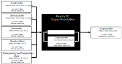

<!-- @page page_techniques_super-resolution-temporal FidelityFX Super Resolution 2.3.4 -->

<h1>FidelityFX Super Resolution 2.3.4 (FSR2)</h1>


AMD FidelityFX Super Resolution 2 (FSR2) is an open source, high-quality solution for producing high resolution frames from lower resolution inputs.

<h2>Table of contents</h2>

- [Introduction](#introduction)
    - [Shading language requirements](#shading-language-requirements)
- [Integration guidelines](#integration-guidelines)
    - [Scaling modes](#scaling-modes)
    - [Performance](#performance)
    - [Memory requirements](#memory-requirements)
    - [Input resources](#input-resources)
    - [Depth buffer configurations](#depth-buffer-configurations)
    - [Providing motion vectors](#providing-motion-vectors)
    - [Reactive mask](#reactive-mask)
    - [Automatically generating reactivity](#automatically-generating-reactivity)
    - [Transparency and composition mask](#transparency-and-composition-mask)
    - [Automatically generating transparency and composition mask](#automatically-generating-transparency-and-composition-mask)
    - [Placement in the frame](#placement-in-the-frame)
    - [Host API](#host-api)
	- [Modular backend](#modular-backend)
    - [Temporal antialiasing](#temporal-antialiasing)
    - [Camera jitter](#camera-jitter)
	- [Camera jump cuts](#camera-jump-cuts)
    - [Mipmap biasing](#mipmap-biasing)
    - [Frame Time Delta Input](#frame-time-delta-input)
    - [HDR support](#hdr-support)
    - [64-wide wavefronts](#64-wide-wavefronts)
    - [API Debug Checker](#debug-checker)
- [Building the sample](#building-the-sample)
- [Limitations](#limitations)
- [Version history](#version-history)
- [References](#references)
- [See also](#see-also)

<h2>Introduction</h2>

**FidelityFX Super Resolution 2** (or **FSR2** for short) is a cutting-edge upscaling technique developed from the ground up to produce high resolution frames from lower resolution inputs.



FSR2 uses temporal feedback to reconstruct high-resolution images while maintaining and even improving image quality compared to native rendering.

FSR2 can enable "practical performance" for costly render operations, such as hardware ray tracing.

<h2>Shading language requirements</h2>

- `HLSL`
  - `CS_6_2`
  - `CS_6_6†`

† `CS_6_6` is used on some hardware which supports 64-wide wavefronts.

<h2>Integration guidelines</h2>

<h3>Scaling modes</h3>
For the convenience of end users, the FSR2 API provides a number of preset scaling ratios which are named.

| Quality           | Per-dimension scaling factor |    
|-------------------|------------------------------|
| Quality           | 1.5x                         |
| Balanced          | 1.7x                         |
| Performance       | 2.0x                         |
| Ultra performance | 3.0x                         |

We strongly recommend that applications adopt consistent naming and scaling ratios in their user interface. This is to ensure that user experience is consistent for your application's users which may have experience of other applications using FSR2. 

<h3>Performance</h3>
Depending on your target hardware and operating configuration FSR2 will operate at different performance levels.

The table below summarizes the measured performance of FSR2 on a variety of hardware in DX12.

| Target resolution | Quality          | RX 7900 XTX| RX 6950 XT | RX 6900 XT | RX 6800 XT | RX 6800 | RX 6700 XT | RX 6650 XT | RX 5700 XT | RX Vega 56 | RX 590 |
|-------------------|------------------|------------|------------|------------|------------|---------|------------|------------|------------|------------|--------|
| 3840x2160         | Quality (1.5x)   | 0.7ms      | 1.1ms      | 1.2ms      | 1.2ms      | 1.4ms   | 2.0ms      | 2.8ms      | 2.4ms      | 4.9ms      | 5.4ms  |
|                   | Balanced (1.7x)  | 0.6ms      | 1.0ms      | 1.0ms      | 1.1ms      | 1.4ms   | 1.8ms      | 2.6ms      | 2.2ms      | 4.1ms      | 4.9ms  |
|                   | Performance (2x) | 0.6ms      | 0.9ms      | 1.0ms      | 1.0ms      | 1.3ms   | 1.7ms      | 2.3ms      | 2.0ms      | 3.6ms      | 4.4ms  |
|                   | Ultra perf. (3x) | 0.5ms      | 0.8ms      | 0.8ms      | 0.9ms      | 1.1ms   | 1.5ms      | 1.8ms      | 1.7ms      | 2.9ms      | 3.7ms  |
| 2560x1440         | Quality (1.5x)   | 0.3ms      | 0.5ms      | 0.5ms      | 0.5ms      | 0.7ms   | 0.9ms      | 1.2ms      | 1.1ms      | 1.9ms      | 2.3ms  |
|                   | Balanced (1.7x)  | 0.3ms      | 0.5ms      | 0.5ms      | 0.5ms      | 0.6ms   | 0.8ms      | 1.1ms      | 1.0ms      | 1.7ms      | 2.1ms  |
|                   | Performance (2x) | 0.3ms      | 0.4ms      | 0.4ms      | 0.4ms      | 0.6ms   | 0.8ms      | 0.9ms      | 0.9ms      | 1.5ms      | 1.9ms  |
|                   | Ultra perf. (3x) | 0.2ms      | 0.4ms      | 0.4ms      | 0.4ms      | 0.5ms   | 0.7ms      | 0.8ms      | 0.8ms      | 1.2ms      | 1.7ms  |
| 1920x1080         | Quality (1.5x)   | 0.2ms      | 0.3ms      | 0.3ms      | 0.3ms      | 0.4ms   | 0.5ms      | 0.6ms      | 0.6ms      | 1.0ms      | 1.3ms  |
|                   | Balanced (1.7x)  | 0.2ms      | 0.3ms      | 0.3ms      | 0.3ms      | 0.4ms   | 0.5ms      | 0.6ms      | 0.6ms      | 0.9ms      | 1.2ms  |
|                   | Performance (2x) | 0.2ms      | 0.2ms      | 0.2ms      | 0.3ms      | 0.3ms   | 0.5ms      | 0.5ms      | 0.5ms      | 0.8ms      | 1.1ms  |
|                   | Ultra perf. (3x) | 0.1ms      | 0.2ms      | 0.2ms      | 0.2ms      | 0.3ms   | 0.4ms      | 0.4ms      | 0.4ms      | 0.7ms      | 0.9ms  |

Figures are rounded to the nearest 0.1ms and are without additional [`sharpness`](../../Kits/FidelityFX/upscalers/include/ffx_upscale.h#L98) and are subject to change.

<h3>Memory requirements</h3>
Using FSR2 requires some additional GPU local memory to be allocated for consumption by the GPU. When using the FSR2 API, this memory is allocated when the FSR2 context is created, and is done so via the series of callbacks which comprise the backend interface. This memory is used to store intermediate surfaces which are computed by the FSR2 algorithm as well as surfaces which are persistent across many frames of the application. The table below includes the amount of memory used by FSR2 under various operating conditions. 

| Resolution | Quality                | Working set (MB) 
| -----------|------------------------|------------------|
| 3840x2160  | Quality (1.5x)         | 438MB            |
|            | Balanced (1.7x)        | 396MB            |
|            | Performance (2x)       | 363MB            |
|            | Ultra performance (3x) | 308MB            |
| 2560x1440  | Quality (1.5x)         | 203MB            |
|            | Balanced (1.7x)        | 184MB            |
|            | Performance (2x)       | 166MB            |
|            | Ultra performance (3x) | 143MB            |
| 1920x1080  | Quality (1.5x)         | 113MB            |
|            | Balanced (1.7x)        | 102MB            |
|            | Performance (2x)       |  98MB            |
|            | Ultra performance (3x) | 80MB             |

Figures are approximations, rounded up to nearest MB using an RX 9070XT GPU in DX12, and are subject to change.

An application can get amount of GPU local memory required by FSR after context creation by calling [`ffxQuery`](../../Kits/FidelityFX/api/include/ffx_api.h#L150) with the valid context and [`ffxQueryDescUpscaleGetGPUMemoryUsage`](../../Kits/FidelityFX/upscalers/include/ffx_upscale.h#L181).

An application can get GPU local memory required by default FSR version before context creation by calling [`ffxQuery`](../../Kits/FidelityFX/api/include/ffx_api.h#L150) with `NULL` context and filling out [`ffxQueryDescUpscaleGetGPUMemoryUsageV2`](../../Kits/FidelityFX/upscalers/include/ffx_upscale.h#L188). To get the memory requirement info for a different upscaler version, additionally link [`ffxOverrideVersion`](../../Kits/FidelityFX/api/include/ffx_api.h#L99). 

See code examples how to call [Query](../getting-started/ffx-api.md#Query).

<h3>Input resources</h3>
FSR2 is a temporal algorithm, and therefore requires access to data from both the current and previous frame. The following table enumerates all external inputs required by FSR2.

The resolution column indicates if the data should be at 'rendered' resolution or 'presentation' resolution. 'Rendered' resolution indicates that the resource should match the resolution at which the application is performing its rendering. Conversely, 'presentation' indicates that the resolution of the target should match that which is to be presented to the user. All resources are from the current rendered frame, for DirectX(R)12 applications all input resources should be transitioned to [`D3D12_RESOURCE_STATE_NON_PIXEL_SHADER_RESOURCE`](https://docs.microsoft.com/en-us/windows/win32/api/d3d12/ne-d3d12-d3d12_resource_states) before calling [`ffxDispatchDescUpscale`](../../Kits/FidelityFX/upscalers/include/ffx_upscale.h#L82).

| Name            | Resolution                   |  Format                            | Type      | Notes                                          |  
| ----------------|------------------------------|------------------------------------|-----------|------------------------------------------------|
| Color buffer    | Render                       | `APPLICATION SPECIFIED`            | Texture   | The render resolution color buffer for the current frame provided by the application. If the contents of the color buffer are in high dynamic range (HDR), then the [`FFX_UPSCALE_ENABLE_HIGH_DYNAMIC_RANGE`](../../Kits/FidelityFX/upscalers/include/ffx_upscale.h#L42) flag should be set in  the [`flags`](../../Kits/FidelityFX/upscalers/include/ffx_upscale.h#L75) field of the [`ffxCreateContextDescUpscale`](../../Kits/FidelityFX/upscalers/include/ffx_upscale.h#L72) structure. |
| Depth buffer    | Render                       | `APPLICATION SPECIFIED (1x FLOAT)` | Texture   | The render resolution depth buffer for the current frame provided by the application. The data should be provided as a single floating point value, the precision of which is under the application's control. The configuration of the depth should be communicated to FSR via the [`flags`](../../Kits/FidelityFX/upscalers/include/ffx_upscale.h#L75) field of the [`ffxCreateContextDescUpscale`](../../Kits/FidelityFX/upscalers/include/ffx_upscale.h#L72) structure. You should set the [`FFX_UPSCALE_ENABLE_DEPTH_INVERTED`](../../Kits/FidelityFX/upscalers/include/ffx_upscale.h#L45) flag if your depth buffer is inverted (that is [1..0] range), and you should set the [`FFX_UPSCALE_ENABLE_DEPTH_INFINITE`](../../Kits/FidelityFX/upscalers/include/ffx_upscale.h#L46) flag if your depth buffer has an infinite far plane. If the application provides the depth buffer in `D32S8` format, then FSR will ignore the stencil component of the buffer, and create an `R32_FLOAT` resource to address the depth buffer. On GCN and RDNA hardware, depth buffers are stored separately from stencil buffers. |
| Motion vectors  | Render or presentation       | `APPLICATION SPECIFIED (2x FLOAT)` | Texture   | The 2D motion vectors for the current frame provided by the application in **[<-width, -height> ... <width, height>]** range. If your application renders motion vectors with a different range, you may use the [`motionVectorScale`](../../Kits/FidelityFX/upscalers/include/ffx_upscale.h#L94) field of the [`ffxDispatchDescUpscale`](../../Kits/FidelityFX/upscalers/include/ffx_upscale.h#L82) structure to adjust them to match the expected range for FSR. Internally, FSR uses 16-bit quantities to represent motion vectors in many cases, which means that while motion vectors with greater precision can be provided, FSR will not benefit from the increased precision. The resolution of the motion vector buffer should be equal to the render resolution, unless the [`FFX_UPSCALE_ENABLE_DISPLAY_RESOLUTION_MOTION_VECTORS`](../../Kits/FidelityFX/upscalers/include/ffx_upscale.h#L43) flag is set in the [`flags`](../../Kits/FidelityFX/upscalers/include/ffx_upscale.h#L75) field of the [`ffxCreateContextDescUpscale`](../../Kits/FidelityFX/upscalers/include/ffx_upscale.h#L72) structure, in which case it should be equal to the presentation resolution. |
| T&C mask        | Render                       | `R8_UNORM`                         | Texture   | Some areas if the rendered image may not have motion vectors matching the change in shading, especially for highly reflective surfaces, or objects with texture animation. In those cases using the T&C mask is a softer alternative compared to the reactive mask, as it only affects locks and color clamping, while the reactive mask reduces the influence of the history. |
| Reactive mask   | Render                       | `R8_UNORM`                         | Texture   | As some areas of a rendered image do not leave a footprint in the depth buffer or include motion vectors, FSR provides support for a reactive mask texture which can be used to indicate to FSR where such areas are. Good examples of these are particles, or alpha-blended objects which do not write depth or motion vectors. If this resource is not set, then FSR's shading change detection logic will handle these cases as best it can, but for optimal results, this resource should be set. For more information on the reactive mask please refer to the [Reactive mask](#reactive-mask) section.  |
| Exposure        | 1x1                          | `R32_FLOAT`                        | Texture   | A 1x1 texture containing the exposure value computed for the current frame. This resource is optional, and may be omitted if the [`FFX_UPSCALE_ENABLE_AUTO_EXPOSURE`](../../Kits/FidelityFX/upscalers/include/ffx_upscale.h#L47) flag is set in the [`flags`](../../Kits/FidelityFX/upscalers/include/ffx_upscale.h#L75) field of the [`ffxCreateContextDescUpscale`](../../Kits/FidelityFX/upscalers/include/ffx_upscale.h#L72) structure.  |

All inputs that are provided at Render Resolution, except for motion vectors, should be rendered with jitter. Motion vectors should not have jitter applied, unless the `FFX_UPSCALE_ENABLE_MOTION_VECTORS_JITTER_CANCELLATION` flag is present.

<h3>Depth buffer configurations</h3>

It is strongly recommended that an inverted, infinite depth buffer is used with FSR. However, alternative depth buffer configurations are supported. An application should inform the FSR API of its depth buffer configuration by setting the appropriate flags during the creation of the [`ffxCreateContextDescUpscale`](../../Kits/FidelityFX/upscalers/include/ffx_upscale.h#L72). The table below contains the appropriate flags.

| FSR flag                         | Note                                                                                       |
|----------------------------------|--------------------------------------------------------------------------------------------|
| [`FFX_UPSCALE_ENABLE_DEPTH_INVERTED`](../../Kits/FidelityFX/upscalers/include/ffx_upscale.h#L45) | A bit indicating that the input depth buffer data provided is inverted [max..0].           |
| [`FFX_UPSCALE_ENABLE_DEPTH_INFINITE`](../../Kits/FidelityFX/upscalers/include/ffx_upscale.h#L46) | A bit indicating that the input depth buffer data provided is using an infinite far plane. |


<h3>Providing motion vectors</h3>

<h4>Space</h4>

A key part of a temporal algorithm (be it antialiasing or upscaling) is the provision of motion vectors. FSR accepts motion vectors in 2D which encode the motion from a pixel in the current frame to the position of that same pixel in the previous frame. FSR expects that motion vectors are provided by the application in [**<-width, -height>**..**<width, height>**] range; this matches screenspace. For example, a motion vector for a pixel in the upper-left corner of the screen with a value of **<width, height>** would represent a motion that traversed the full width and height of the input surfaces, originating from the bottom-right corner.


If your application computes motion vectors in another space - for example normalized device coordinate space - then you may use the [`motionVectorScale`](../../Kits/FidelityFX/upscalers/include/ffx_upscale.h#L94) field of the [`ffxDispatchDescUpscale`](../../Kits/FidelityFX/upscalers/include/ffx_upscale.h#L82) structure to instruct FSR to adjust them to match the expected range for FSR. The code examples below illustrate how motion vectors may be scaled to screen space. The example HLSL and C++ code below illustrates how NDC-space motion vectors can be scaled using the FSR host API.

```HLSL
// GPU: Example of application NDC motion vector computation
float2 motionVector = (previousPosition.xy / previousPosition.w) - (currentPosition.xy / currentPosition.w);

// CPU: Matching FSR 2.0 motionVectorScale configuration
dispatchParameters.motionVectorScale.x = (float)renderWidth;
dispatchParameters.motionVectorScale.y = (float)renderHeight;
```

<h4>Precision & resolution </h4>

Internally, FSR uses 16-bit quantities to represent motion vectors in many cases, which means that while motion vectors with greater precision can be provided, FSR will not currently benefit from the increased precision. The resolution of the motion vector buffer should be equal to the render resolution, unless the [`FFX_UPSCALE_ENABLE_DISPLAY_RESOLUTION_MOTION_VECTORS`](../../Kits/FidelityFX/upscalers/include/ffx_upscale.h#L43) flag is set in the [`flags`](../../Kits/FidelityFX/upscalers/include/ffx_upscale.h#L75) field of the [`ffxCreateContextDescUpscale`](../../Kits/FidelityFX/upscalers/include/ffx_upscale.h#L72) structure when creating the [`ffxContext`](../../Kits/FidelityFX/api/include/ffx_api.h#L132), in which case it should be equal to the presentation resolution.

<h4>Coverage</h4>

FSR will perform better quality upscaling when more objects provide their motion vectors. It is therefore advised that all opaque, alpha-tested and alpha-blended objects should write their motion vectors for all covered pixels. If vertex shader effects are applied - such as scrolling UVs - these calculations should also be factored into the calculation of motion for the best results. For alpha-blended objects it is also strongly advised that the alpha value of each covered pixel is stored to the corresponding pixel in the [reactive mask](#reactive-mask). This will allow FSR to perform better handling of alpha-blended objects during upscaling. The reactive mask is especially important for alpha-blended objects where writing motion vectors might be prohibitive, such as particles.

<h3>Reactive mask</h3>

In the context of FSR, the term "reactivity" means how much influence the samples rendered for the current frame have over the production of the final upscaled image. Typically, samples rendered for the current frame contribute a relatively modest amount to the result computed by FSR; however, there are exceptions. To produce the best results for fast moving, alpha-blended objects, FSR requires the [Reproject & accumulate](#accumulate) stage to become more reactive for such pixels. As there is no good way to determine from either color, depth or motion vectors which pixels have been rendered using alpha blending, FSR performs best when applications explicitly mark such areas.

Therefore, it is strongly encouraged that applications provide a reactive mask to FSR. The reactive mask guides FSR on where it should reduce its reliance on historical information when compositing the current pixel, and instead allow the current frame's samples to contribute more to the final result. The reactive mask allows the application to provide a value from [0.0..1.0] where 0.0 indicates that the pixel is not at all reactive (and should use the default FSR composition strategy), and a value of 1.0 indicates the pixel should be fully reactive. This is a floating point range and can be tailored to different situations.

While there are other applications for the reactive mask, the primary application for the reactive mask is producing better results of upscaling images which include alpha-blended objects. A good proxy for reactiveness is actually the alpha value used when compositing an alpha-blended object into the scene, therefore, applications should write `alpha` to the reactive mask. It should be noted that it is unlikely that a reactive value of close to 1 will ever produce good results. Therefore, we recommend clamping the maximum reactive value to around 0.9.

If a [Reactive mask](#reactive-mask) is not provided to FSR (by setting the [`reactive`](../../Kits/FidelityFX/upscalers/include/ffx_upscale.h#L90) field of [`ffxDispatchDescUpscale`](../../Kits/FidelityFX/upscalers/include/ffx_upscale.h#L82) to `NULL`) then an internally generated 1x1 texture with a cleared reactive value will be used.

<h3>Automatically generating reactivity</h3>

To help applications generate the [Reactive mask](#reactive-mask) and the [Transparency & composition mask](#transparency-and-composition-mask), FSR provides an optional helper API. Under the hood, the API launches a compute shader which computes these values for each pixel using a luminance-based heuristic.

Applications wishing to do this can call the [`ffxDispatchDescUpscaleGenerateReactiveMask`](../../Kits/FidelityFX/upscalers/include/ffx_upscale.h#L149) function and should pass two versions of the color buffer, one containing opaque only geometry, and the other containing both opaque and alpha-blended objects.

<h3>Transparency and composition mask</h3>

In addition to the [Reactive mask](#reactive-mask), FSR provides for the application to denote areas of other specialist rendering which should be accounted for during the upscaling process. Examples of such special rendering include areas of raytraced reflections or animated textures.

While the [Reactive mask](#reactive-mask) adjusts the accumulation balance, the [Transparency & composition mask](#transparency-and-composition-mask) adjusts the pixel history protection mechanisms. The mask also removes the effect of the luminance instability factor. A pixel with a value of 0 in the [Transparency & composition mask](#transparency-and-composition-mask) does not perform any additional modification to the lock for that pixel. Conversely, a value of 1 denotes that the lock for that pixel should be completely removed.

If a [Transparency & composition mask](#transparency-and-composition-mask) is not provided to FSR (by setting the [`transparencyAndComposition`](../../Kits/FidelityFX/upscalers/include/ffx_upscale.h#L91) field of [`ffxDispatchDescUpscale`](../../Kits/FidelityFX/upscalers/include/ffx_upscale.h#L82) to `NULL`) then an internally generated 1x1 texture with a cleared transparency and composition value will be used.

<h3>Exposure</h3>

FSR provides two values which control the exposure used when performing upscaling. They are as follows:

1. **Pre-exposure** a value by which we divide the input signal to get back to the original signal produced by the game before any packing into lower precision render targets.
2. **Exposure** a value which is multiplied against the result of the pre-exposed color value.

The exposure value should match that which the application uses during any subsequent tonemapping passes performed by the application. This means FSR will operate consistently with what is likely to be visible in the final tonemapped image.

> In various stages of the FSR algorithm described in this document, FSR will compute its own exposure value for internal use. It is worth noting that all outputs from FSR will have this internal tonemapping reversed before the final output is written. Meaning that FSR returns results in the same domain as the original input signal.

Poorly selected exposure values can have a drastic impact on the final quality of FSR's upscaling. Therefore, it is recommended that [`FFX_UPSCALE_ENABLE_AUTO_EXPOSURE`](../../Kits/FidelityFX/upscalers/include/ffx_upscale.h#L47) is used by the application, unless there is a particular reason not to. When [`FFX_UPSCALE_ENABLE_AUTO_EXPOSURE`](../../Kits/FidelityFX/upscalers/include/ffx_upscale.h#L47) is set in the [`flags`](../../Kits/FidelityFX/upscalers/include/ffx_upscale.h#L75) field of the [`ffxCreateContextDescUpscale`](../../Kits/FidelityFX/upscalers/include/ffx_upscale.h#L72) structure, the exposure calculation shown in the HLSL code below is used to compute the exposure value, which matches the exposure response of ISO 100 film stock.

```HLSL
float ComputeAutoExposureFromAverageLog(float averageLogLuminance)
{
	const float averageLuminance = exp(averageLogLuminance);
	const float S = 100.0f; // ISO arithmetic speed
	const float K = 12.5f;
	const float exposureIso100 = log2((averageLuminance * S) / K);
	const float q = 0.65f;
	const float luminanceMax = (78.0f / (q * S)) * pow(2.0f, exposureIso100);
	return 1 / luminanceMax;
}
```

<h3>Placement in the frame</h3>

The primary goal of FSR is to improve application rendering performance by using a temporal upscaling algorithm relying on a number of inputs. Therefore, its placement in the pipeline is key to ensuring the right balance between the highest quality visual quality and great performance.


With any image upscaling approach is it important to understand how to place other image-space algorithms with respect to the upscaling algorithm. Placing these other image-space effects before the upscaling has the advantage that they run at a lower resolution, which of course confers a performance advantage onto the application. However, it may not be appropriate for some classes of image-space techniques. For example, many applications may introduce noise or grain into the final image, perhaps to simulate a physical camera. Doing so before an upscaler might cause the upscaler to amplify the noise, causing undesirable artifacts in the resulting upscaled image. The following table divides common real-time image-space techniques into two columns. 'Post processing A' contains all the techniques which typically would run before FSR's upscaling, meaning they would all run at render resolution. Conversely, the 'Post processing B' column contains all the techniques which are recommend to run after FSR, meaning they would run at the larger, presentation resolution.

| Post processing A              | Post processing B    |
|--------------------------------|----------------------|
| Screenspace reflections        | Film grain           |
| Screenspace ambient occlusion  | Chromatic aberration |
| Denoisers (shadow, reflections)| Vignette             |
| Exposure (optional)            | Tonemapping          |
|                                | Bloom                |
|                                | Depth of field       |
|                                | Motion blur          |

Please note that the recommendations here are for guidance purposes only and depend on the precise characteristics of your application's implementation.

<h3>Temporal Antialiasing</h3>

Temporal antialiasing (TAA) is a technique which uses the output of previous frames to construct a higher quality output from the current frame. As FSR has a similar goal - albeit with the additional goal of also increasing the resolution of the rendered image - there is no longer any need to include a separate TAA pass in your application.

<h3>Camera jitter</h3>

FSR relies on the application to apply sub-pixel jittering while rendering - this is typically included in the projection matrix of the camera. To make the application of camera jitter simple, the FSR API provides a small set of utility function which computes the sub-pixel jitter offset for a particular frame within a sequence of separate jitter offsets.

Internally, these function implement a Halton[2,3] sequence [[Halton](#references)]. The goal of the Halton sequence is to provide spatially separated points, which cover the available space.


It is important to understand that the values returned from the [`ffxQueryDescUpscaleGetJitterOffset`](../../Kits/FidelityFX/upscalers/include/ffx_upscale.h#L138) are in unit pixel space, and in order to composite this correctly into a projection matrix we must convert them into projection offsets. The diagram above shows a single pixel in unit pixel space, and in projection space. The code listing below shows how to correctly composite the sub-pixel jitter offset value into a projection matrix.

``` CPP
ffx::ReturnCode                     retCode;
int32_t                             jitterPhaseCount;
ffx::QueryDescUpscaleGetJitterPhaseCount getJitterPhaseDesc{};
getJitterPhaseDesc.displayWidth   = displayWidth;
getJitterPhaseDesc.renderWidth    = renderWidth;
getJitterPhaseDesc.pOutPhaseCount = &jitterPhaseCount;
retCode = ffx::Query(fsrContext, getJitterPhaseDesc);

ffx::QueryDescUpscaleGetJitterOffset getJitterOffsetDesc{};
getJitterOffsetDesc.index                              = jitterIndex;
getJitterOffsetDesc.phaseCount                         = jitterPhaseCount;
getJitterOffsetDesc.pOutX                              = &jitterX;
getJitterOffsetDesc.pOutY                              = &jitterY;
retCode = ffx::Query(fsrContext, getJitterOffsetDesc);

// Calculate the jittered projection matrix.
const float jitterX = 2.0f * jitterX / (float)renderWidth;
const float jitterY = -2.0f * jitterY / (float)renderHeight;
const Matrix4 jitterTranslationMatrix = translateMatrix(Matrix3::identity, Vector3(jitterX, jitterY, 0));
const Matrix4 jitteredProjectionMatrix = jitterTranslationMatrix * projectionMatrix;
```

Jitter should be applied to *all* rendering. This includes opaque, alpha transparent, and raytraced objects. For rasterized objects, the sub-pixel jittering values calculated by the [`ffxQueryDescUpscaleGetJitterOffset`](../../Kits/FidelityFX/upscalers/include/ffx_upscale.h#L138) function can be applied to the camera projection matrix which is ultimately used to perform transformations during vertex shading. For raytraced rendering, the sub-pixel jitter should be applied to the ray's origin - often the camera's position.

Whether you elect to use the recommended [`ffxQueryDescUpscaleGetJitterOffset`](../../Kits/FidelityFX/upscalers/include/ffx_upscale.h#L138) query or your own sequence generator, you must set the [`jitterOffset`](../../Kits/FidelityFX/upscalers/include/ffx_upscale.h#L93) field of the [`ffxDispatchDescUpscale`](../../Kits/FidelityFX/upscalers/include/ffx_upscale.h#L82) structure to inform FSR of the jitter offset that has been applied in order to render each frame. Moreover, if not using the recommended [`ffxQueryDescUpscaleGetJitterOffset`](../../Kits/FidelityFX/upscalers/include/ffx_upscale.h#L138) query, care should be taken that your jitter sequence never generates a null vector; that is value of 0 in both the X and Y dimensions.

The table below shows the jitter sequence length for each of the default quality modes.

 | Quality mode      | Scaling factor          | Sequence length |
 |-------------------|-------------------------|-----------------|
 | Quality           | 1.5x (per dimension)    | 18              |
 | Balanced          | 1.7x (per dimension)    | 23              |
 | Performance       | 2.0x (per dimension)    | 32              |
 | Ultra performance | 3.0x (per dimension)    | 72              |
 | Custom            | [1..n]x (per dimension) | `ceil(8 * n^2)` |

<h3>Camera jump cuts</h3>

Most applications with real-time rendering have a large degree of temporal consistency between any two consecutive frames. However, there are cases where a change to a camera's transformation might cause an abrupt change in what is rendered. In such cases, FSR is unlikely to be able to reuse any data it has accumulated from previous frames, and should clear this data such to exclude it from consideration in the compositing process. In order to indicate to FSR that a jump cut has occurred with the camera you should set the [`reset`](../../Kits/FidelityFX/upscalers/include/ffx_upscale.h#L101) field of the [`ffxDispatchDescUpscale`](../../Kits/FidelityFX/upscalers/include/ffx_upscale.h#L82) structure to `true` for the first frame of the discontinuous camera transformation.

Rendering performance may be slightly less than typical frame-to-frame operation when using the reset flag, as FSR will clear some additional internal resources.

<h3>Mipmap biasing</h3>

Applying a negative mipmap biasing will typically generate an upscaled image with better texture detail. We recommend applying the following formula to your Mipmap bias:

``` CPP
mipBias = log2(renderResolution/displayResolution) - 1.0;
```

It is suggested that applications adjust the MIP bias for specific high-frequency texture content which is susceptible to showing temporal aliasing issues.

The following table illustrates the mipmap biasing factor which results from evaluating the above pseudocode for the scaling ratios matching the suggested quality modes that applications should expose to end users.

 | Quality mode      | Scaling factor        | Mipmap bias |
 |-------------------|-----------------------|-------------|
 | Quality           | 1.5X (per dimension)  | -1.58       |
 | Balanced          | 1.7X (per dimension)  | -1.76       |
 | Performance       | 2.0X (per dimension)  | -2.0        |
 | Ultra performance | 3.0X (per dimension)  | -2.58       |

<h3>Frame Time Delta Input</h3>

The FSR API requires [`frameTimeDelta`](../../Kits/FidelityFX/upscalers/include/ffx_upscale.h#L99) be provided by the application through the [`ffxDispatchDescUpscale`](../../Kits/FidelityFX/upscalers/include/ffx_upscale.h#L82) structure. This value is in __milliseconds__: if running at 60fps, the value passed should be around __16.6f__.

The value is used within the temporal component of the FSR 2 auto-exposure feature. This allows for tuning of the history accumulation for quality purposes.

<h3>HDR support</h3>

High dynamic range images are supported in FSR. To enable this, you should set the [`FFX_UPSCALE_ENABLE_HIGH_DYNAMIC_RANGE`](../../Kits/FidelityFX/upscalers/include/ffx_upscale.h#L42) bit in the [`flags`](../../Kits/FidelityFX/upscalers/include/ffx_upscale.h#L75) field of the [`ffxCreateContextDescUpscale`](../../Kits/FidelityFX/upscalers/include/ffx_upscale.h#L72) structure. Images should be provided to FSR in linear color space.

> Support for additional color spaces might be provided in a future revision of FSR.

<h3>64-wide wavefronts</h3>

Modern GPUs execute collections of threads - called wavefronts - together in a SIMT fashion. The precise number of threads which constitute a single wavefront is a hardware-specific quantity. Some hardware, such as AMD's GCN and RDNA-based GPUs support collecting 64 threads together into a single wavefront. Depending on the precise characteristics of an algorithm's execution, it may be more or less advantageous to prefer a specific wavefront width. With the introduction of Shader Model 6.6, Microsoft added the ability to specific the width of a wavefront via HLSL. For hardware, such as RDNA which supports both 32 and 64 wide wavefront widths, this is a very useful tool for optimization purposes, as it provides a clean and portable way to ask the driver software stack to execute a wavefront with a specific width.

For DirectX(R)12 based applications which are running on RDNA and RDNA2-based GPUs and using the Microsoft Agility SDK, the FSR host API will select a 64-wide wavefront width.

<h3>Debug Checker</h3>
Enable debug checker to validate application supplied inputs at dispatch upscale. This feature can be enabled in any build configuration of the runtime (IE. release binaries from PrebuiltSignedDll folder or debug build). It is recommended this is enabled only in development builds of game.

Passing the [`FFX_UPSCALE_ENABLE_DEBUG_CHECKING`](../../Kits/FidelityFX/upscalers/include/ffx_upscale.h#L49) flag within the flags member of [`ffxCreateContextDescUpscale`](../../Kits/FidelityFX/upscalers/include/ffx_upscale.h#L72) will output textual warning messages from upscaler to debugger TTY by default. Application can set the callback fuction for runtime to pass the messages to the underlying application. Application can assign `fpMessage` from [`ffxCreateContextDescUpscale`](../../Kits/FidelityFX/upscalers/include/ffx_upscale.h#L72) to suitable function. `fpMessage` is of type `ffxApiMessage` which is a function pointer for passing string messages of various types.

An example of the kind of output that can occur when the checker observes possible issues is below:

```
FSR_API_DEBUG_WARNING: FFX_FSR_ENABLE_DEPTH_INFINITE and FFX_FSR_ENABLE_DEPTH_INVERTED present, cameraFar value is very low which may result in depth separation artefacting
FSR_API_DEBUG_WARNING: frameTimeDelta is less than 1.0f - this value should be milliseconds (~16.6f for 60fps)
```

<h2>Building the sample</h2>

To build the FSR sample, please follow the following instructions:

1. Download and install the following software developer tool minimum versions:
    - [Visual Studio 2022](https://visualstudio.microsoft.com/downloads/) (Install ```vcpkg package manager``` as part of the install process)
    - [Windows 10 SDK 10.0.18362.0](https://developer.microsoft.com/en-us/windows/downloads/windows-10-sdk)

 2. Open the Visual Studio solution:

    ```bash
    > <installation path>\Samples\FidelityFX_FSR\dx12\FidelityFX_FSR_2022.sln
    ```

 3. First time vcpkg installation

   - If vcpkg has not previously been initialized in Visual Studio, please do so with the following:
     - From the menu, select ``Tools`` and then ``Visual Studio Command Prompt`` to bring up the terminal.
     - Type ``vcpkg integrate install`` and hit ``enter`` key.
     - Close and re-open the solution.

<h3>Building the project</h3>

The Visual Studio solution file (.sln) will contain all projects needed to build the effect sample. To build the projects in the solution, you should click on ``Build`` and then ``Build solution`` from the menu at the top of Visual Studio. This will build all dependencies of the sample (such as the FidelityFX Cauldron Framework), then build the sample application.

<h3>Running the project</h3>

To run a project from Visual Studio:

 1. If not already highlighted, select the sample project in the solution explorer.

 2. Right-click the project and select `Set as Start-up project`.

 3. Right-click the project and select `Properties`

 4. Under `Configuration Properties`, click on the `Debugging` entry.

 5. Set `Working Directory` to `$(TargetDir)` for all configurations (`Debug` and `Release`).

 6. Click `Apply` then `OK` to close the properties panel.

 7. Click on the `Build` menu item from the toolstrip, and then click on `Run`.

<h2>Limitations</h2>

FSR requires a GPU with typed UAV load and R16G16B16A16_UNORM support.

<h2>Version history</h2>

| Version        | Date              |
| ---------------|-------------------|
| **2.0.1**      | 2022-06-22        |
| **2.1.0**      | 2022-09-08        |
| **2.1.1**      | 2022-09-15        |
| **2.1.2**      | 2022-10-19        |
| **2.2.0**      | 2023-02-16        |
| **2.2.1**      | 2023-05-12        |
| **2.3.1**      | 2023-11-28        |
| **2.3.2**      | 2024-06-05        |
| **2.3.3**      | 2025-05-08        |
| **2.3.4**      | 2025-08-20        |

Refer to changelog for more detail on versions.


<h2>References</h2>

[**Akeley-06**] Kurt Akeley and Jonathan Su, **"Minimum Triangle Separation for Correct Z-Buffer Occlusion"**, 
[http://www.cs.cmu.edu/afs/cs/academic/class/15869-f11/www/readings/akeley06_triseparation.pdf](https://www.cs.cmu.edu/afs/cs/academic/class/15869-f11/www/readings/akeley06_triseparation.pdf)

[**Lanczos**] Lanczos resampling, **"Lanczos resampling"**, [https://en.wikipedia.org/wiki/Lanczos_resampling](https://en.wikipedia.org/wiki/Lanczos_resampling)

[**Halton**] Halton sequence, **"Halton sequence"**, [https://en.wikipedia.org/wiki/Halton_sequence](https://en.wikipedia.org/wiki/Halton_sequence)

[**YCoCg**] YCoCg Color Space, [https://en.wikipedia.org/wiki/YCoCg](https://en.wikipedia.org/wiki/YCoCg)

<h2>See also</h2>

- [FidelityFX Super Resolution](../samples/super-resolution.md)
- [FidelityFX Naming guidelines](../getting-started/naming-guidelines.md)
